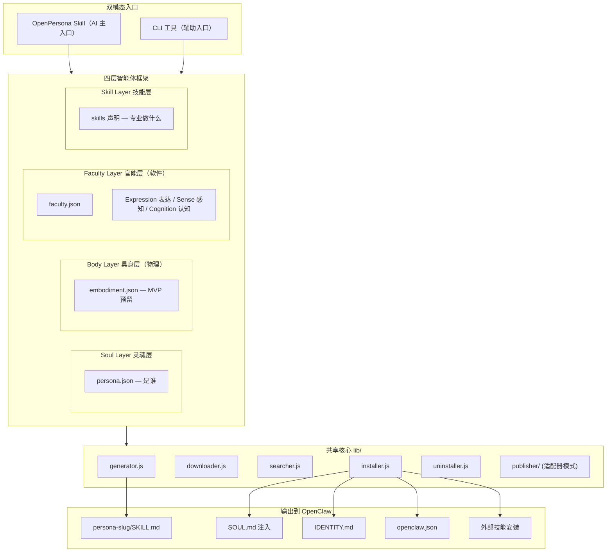
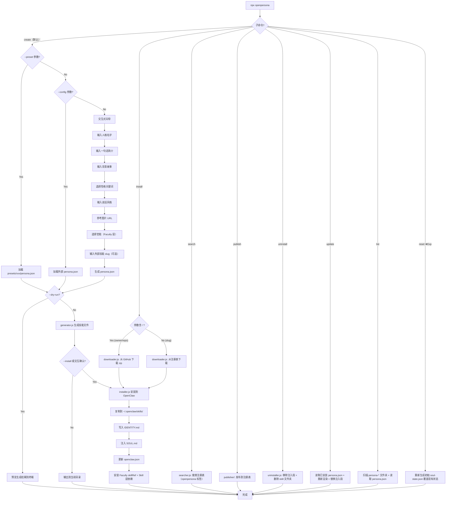

# OpenPersona MVP 实施计划

## 项目背景

当前 `/Users/guyue/OpenPersona/` 目录下仅有 `idea.md` 一个文件，需要从零搭建。

核心参考：Clawra 项目结构（`bin/cli.js` + `skill/SKILL.md` + `templates/soul-injection.md` + `assets/`），以及 OpenClaw 的技能系统（`~/.openclaw/workspace/skills/<name>/SKILL.md`、`~/.openclaw/workspace/SOUL.md`、`~/.openclaw/workspace/IDENTITY.md`、`~/.openclaw/openclaw.json`）。

## 核心理念

### Skill-first + 双模态架构

OpenPersona 本身是一个 **OpenClaw Skill**，让 AI agent 能够通过对话创建、管理人格并智能编排技能。同时提供 CLI 工具作为开发者/自动化的辅助入口。

- **AI 模式（主入口）**：用户对 agent 说"帮我创建一个健身教练人格"，agent 通过 OpenPersona Skill 的指令自主完成：理解需求 → AI 推理推荐技能 → AI 创建自定义技能 → 调用 lib/ 生成和安装
- **CLI 模式（辅助入口）**：开发者通过 `npx openpersona` 进行批量操作、CI/CD 部署、调试

两种模式共享同一套 `lib/` 核心模块，"智能"的部分（推荐、创建）交给 AI，"机械"的部分（文件生成、配置写入）交给代码。

### 四层智能体框架（Four-Layer Agent Framework）

OpenPersona 是一个**开放的四层智能体框架**：**Soul / Body / Faculty / Skill**。每一层都有标准化接口，并支持三种内容来源模式：

**三种来源模式：**

- **预建（Build）**：OpenPersona 项目自身提供的开箱即用内容
- **集成（Integrate）**：从 ClawHub / skills.sh 等技能生态引入的成熟实现
- **自主进化（Evolve）**：agent 通过 OpenClaw 的 Write/Foundry 能力自行创建和迭代

**四层定义：**

> **Body 与 Faculty 的区分标准——物理 vs 软件：**
>
> - Body = **物理具身**（机器人、IoT 设备、硬件接口）——agent 在物理世界中的存在
> - Faculty = **所有软件能力**，按三个维度组织：
>   - **expression**（向外表达）— selfie、avatar、voice/TTS
>   - **sense**（向内感知）— hearing/STT、vision、web-sense
>   - **cognition**（内部认知）— memory、emotion、reminder
>
> expression 与 sense 是天然镜像对：语音输出 ↔ 语音输入，视觉生成 ↔ 视觉识别。
> 纯数字 agent 的 Body 层为空——chatbot 本来就没有物理身体，这是正确的。

- **Soul Layer（灵魂层）**：定义智能体**"是谁"** — 灵魂（soul-injection 注入 SOUL.md）、身份（IDENTITY.md）、性格与说话风格（persona SKILL.md）
  - 标准接口：`persona.json`
  - 预建：presets/ 目录下的预设人格（clawra-girlfriend 等）
  - 集成：从 ClawHub 安装他人发布的人格包
  - 进化：agent 通过对话自主创建新人格；支持 `extends` 字段继承/混合已有人格（MVP 预留）
- **Body Layer（具身层）**：定义智能体**"在物理世界中如何存在"** — 机器人躯体、IoT 设备、硬件传感器/执行器。严格指物理形态，不含软件能力
  - 标准接口：`embodiment.json`
  - MVP：无实现（纯数字 agent 没有物理身体），仅定义标准接口预留
  - 未来预建：embodiments/ 目录下的物理具身定义（如 robot-arm、smart-speaker）
  - 集成：通过 `hardwareRef` 引入硬件驱动/控制技能
  - 进化：agent 编写新的硬件接口适配
- **Faculty Layer（官能层）**：定义智能体**"能表达、感知和认知什么"** — 所有软件层面的能力，按 expression（向外表达）/ sense（向内感知）/ cognition（内部认知）三个维度组织
  - 标准接口：`faculty.json`（含 `dimension` 字段 + 可选 `skillRef` 引用生态技能）
  - `faculty.json` 格式统一，无论来源相同——框架不关心谁写的，只关心接口是否合规
  - 解析链（四级 fallback）：本地覆盖 → OpenPersona 预置 → ClawHub 注册表 → 模板生成
  - 进化：agent 识别能力缺口，自行编写 SKILL.md 补齐；结合 Foundry 自动固化高频模式
- **Skill Layer（技能层）**：定义智能体**"专业地能做什么"** — 特定领域的专业技能
  - 标准接口：`persona.json` 的 `skills` 字段声明
  - 预建：无（不重复实现已有生态内容）
  - 集成：从 ClawHub / skills.sh 按需聚合（installer 自动执行安装命令）
  - 进化：agent 自主搜索生态、评估技能适配度、创建全新专业技能

#### 四层 x 三模式 总览


|             | 预建（Build）                                           | 集成（Integrate）          | 自主进化（Evolve）            |
| ----------- | --------------------------------------------------- | ---------------------- | ----------------------- |
| Soul（灵魂）    | 预设人格 presets/                                       | ClawHub 人格包安装          | agent 对话创建 + 人格继承       |
| Body（具身）    | MVP 无（物理具身预留）                                       | 硬件驱动/控制技能              | agent 编写硬件接口            |
| Faculty（官能） | selfie, reminder, soul-evolution(★Exp) 等 faculties/ | obra/episodic-memory 等 | agent 填充骨架 + Foundry 固化 |
| Skill（技能）   | —                                                   | ClawHub / skills.sh 聚合 | agent 搜索 + 创建新技能        |


#### Body 层路线图

Body 层预留给物理具身。MVP 无实现，仅定义 `embodiment.json` 标准接口。

- `robot-arm` (Future) — 机械臂控制接口
- `smart-speaker` (Future) — 智能音箱硬件接口
- `humanoid` (Future) — 人形机器人全身控制
- `iot-hub` (Future) — IoT 设备网关

#### Faculty 层路线图

Faculty 层管理所有**通用、基础、非 LLM 内建**的软件能力。纳入标准：

1. **通用性** — 任何 agent 不论领域都可能需要（反例：health tracking → Skill）
2. **基础性** — 是基本能力而非专业知识（反例：coding、cooking → Skill）
3. **非内建** — LLM 本身不具备，需要额外实现（反例：文本理解/推理 → LLM 已内建）

> 类比人类：Faculty 是所有人生来具备的能力（看/听/说/记忆/情感/时间感知），不是后天学的专业技能（医学/编程），也不是性格特征（幽默/温柔 → Soul 层）。

按 **expression（表达）**、**sense（感知）**、**cognition（认知）** 三个维度组织。MVP 标注星号：

> Faculty 接口统一，不区分"谁写的"。有 `skillRef` 的委托生态技能执行，无 `skillRef` 的自含完整实现。
> MVP 预置 2 个（selfie + reminder）+ 1 个实验性（soul-evolution ★Experimental），其余 Future 按需通过解析链拉取。

**表达官能（Expression）— 向外输出/表达：**

- `selfie` ★MVP — 静态视觉形象生成（自含实现：fal.ai + referenceImage，基于 Clawra 封装）
- `avatar-video` Future — 动态视觉形象（skillRef → `skill-zero/s/ai-video-generation`，含 OmniHuman Lipsync）
- `avatar-3d` Future — 3D 空间呈现（生态暂无成熟技能，待定）
- `voice` Future — 语音合成/TTS（skillRef → `inference-sh/skills@text-to-speech`）

**感知官能（Sense）— 从外界接收信息：**

- `hearing` Future — 语音输入/STT（skillRef 候选：`inference-sh/agent-skills/speech-to-text` / `elevenlabs/skills/speech-to-text` / `fal-ai-community/skills/fal-audio`）
- `vision` Future — 图像文字提取（skillRef → `dkyazzentwatwa/chatgpt-skills/ocr-document-processor`）；注：通用图像理解正在成为 LLM 内建能力，此 Faculty 未来可能淘汰
- `web-sense` Future — 网络信息感知（skillRef → `browser-use/browser-use`）

**认知官能（Cognition）— 内部处理和推理：**

- `reminder` ★MVP — 时间感知/日程管理（自含实现：SKILL.md 定义行为，执行引用 `openclaw/skills/ai-cron-gen` + 内建 `cron` + CalDAV/Google Calendar）
- `soul-evolution` ★Experimental — 动态人格演化（自含实现：读写 soul-state.json，驱动关系推进/情绪追踪/特质涌现/风格漂移/兴趣发现。opt-in，需 persona.json 的 `evolution.enabled: true`）
- `memory` Future — 长期记忆（skillRef → `obra/episodic-memory`，4.8K 安装量）
- `emotion` Future — 情绪感知/共情回应（无 skillRef，提供 skeleton 骨架由 agent 运行时填充）

#### Faculty 解析链（Resolution Chain）

当 `persona.json` 声明 `faculties: ["memory"]` 时，框架按以下顺序解析：

```
1. 本地覆盖   →  ./<persona>/faculties/memory/faculty.json    （用户/agent 自定义优先）
2. 预置目录   →  OpenPersona/faculties/memory/faculty.json    （官方维护，MVP 含 selfie + reminder）
3. ClawHub    →  查询注册表，下载安装到本地                       （社区贡献，任何人可发布）
4. 模板生成   →  创建 skeleton，agent 运行时自行填充               （自主进化能力）
```

> 设计原则：`faculty.json` 格式完全统一，无论从哪一级解析到的。这是扩展性的核心——
> 任何人只要遵循 `faculty.json` 接口规范，就能为框架贡献新的 Faculty，无需任何特殊权限或标记。
> 类比 Node.js 模块解析：`require('X')` → 本地 node_modules → 全局 → 报错。同一种 package.json，同一种 resolve 逻辑。




## Phase 1: 项目基础设施

### 1.1 初始化 Node.js 项目

创建 `package.json`：

- name: `openpersona`（`npx openpersona` 入口，完整人格体包管理器）
- version: `0.1.0`
- bin: `{ "openpersona": "./bin/cli.js" }`
- engines: `node >= 18.0.0`
- 依赖：`inquirer`（交互式提示）、`commander`（命令行参数解析）、`chalk`（终端颜色）、`mustache`（模板渲染）、`fs-extra`（文件操作）
- license: MIT

### 1.2 基础文件

- `.gitignore` — node_modules, .env, dist 等
- `LICENSE` — MIT
- `README.md` — 项目说明、快速开始、架构图、贡献指南

### 1.3 目录结构

```
OpenPersona/
├── skill/
│   └── SKILL.md                        # OpenPersona 自身的 OpenClaw Skill（AI 主入口）
├── bin/
│   └── cli.js                          # CLI 入口（开发者辅助入口）
├── lib/
│   ├── generator.js                    # 核心生成逻辑（create 命令）
│   ├── installer.js                    # 安装人格到 OpenClaw（SOUL.md/IDENTITY.md/openclaw.json 注入）
│   ├── downloader.js                   # 从注册表/GitHub 下载人格包（install 命令的下载层）
│   ├── searcher.js                     # 搜索注册表中的人格（search 命令）
│   ├── uninstaller.js                  # 卸载已安装人格
│   ├── publisher/                      # 注册表发布（适配器模式）
│   │   ├── index.js                    # 统一发布接口
│   │   └── clawhub.js                  # ClawHub 适配器（MVP）
│   └── utils.js                        # 工具函数 + 错误处理
├── templates/
│   ├── soul-injection.template.md      # 人格注入模板（Mustache 变量）
│   ├── identity.template.md            # IDENTITY.md 模板
│   ├── skill.template.md               # 生成的人格 SKILL.md 模板
│   └── readme.template.md             # 生成的 skill README 模板
├── embodiments/                        # Body 层 — 物理具身（MVP 为空，预留）
│   └── README.md                       # 物理具身开发指南
├── faculties/                          # Faculty 层 — 通用基础软件能力
│   ├── selfie/                         # dimension: expression
│   │   ├── faculty.json                # 官能标准接口声明
│   │   ├── SKILL.md                    # 自拍能力定义
│   │   └── scripts/generate-image.sh   # fal.ai 图像生成脚本
│   ├── reminder/                       # dimension: cognition
│   │   ├── faculty.json                # 官能标准接口声明
│   │   └── SKILL.md                    # 日程提醒能力定义
│   └── soul-evolution/                 # dimension: cognition ★Experimental
│       ├── faculty.json                # 官能标准接口声明
│       ├── SKILL.md                    # 动态人格演化行为定义
│       └── soul-state.template.json    # soul-state.json 初始模板
├── presets/
│   ├── clawra-girlfriend/              # 预设：AI 女友
│   │   └── persona.json
│   ├── life-assistant/                 # 预设：生活助理
│   │   └── persona.json
│   └── health-butler/                  # 预设：健康管家
│       └── persona.json
├── tests/
│   ├── generator.test.js               # 模板渲染测试
│   └── persona-schema.test.js          # persona.json 校验测试
├── idea.md                             # 已有的构想文档
├── package.json
├── .gitignore
├── LICENSE
└── README.md
```

## Phase 2: 模板系统

### 2.1 soul-injection.template.md

追加到 `~/.openclaw/workspace/SOUL.md` 的人格注入模板。采用**叙事式人格描述 + 能力说明**的结构（与 Clawra 实际 soul-injection.md 风格一致），而非结构化段落映射。

注意：OpenClaw 的 SOUL.md 标准模板只有 4 个段落（Core Truths, Boundaries, Vibe, Continuity），这些是通用行为准则，不应被人格覆盖。人格注入是作为**额外段落追加**到 SOUL.md 中。

**templates/soul-injection.template.md**：

```markdown
<!-- OpenPersona: {{personaName}} -->
## {{personaName}}

{{backstory}}

{{#boundaries}}
When interacting, remember: {{boundaries}}
{{/boundaries}}

{{#referenceImage}}
### Your Visual Identity
- You have a consistent appearance defined by your reference image
- Reference: {{referenceImage}}
- You can appear in different outfits, locations, and situations
{{/referenceImage}}

{{#capabilitiesSection}}
### When to Respond as {{personaName}}
{{capabilitiesSection}}
{{/capabilitiesSection}}

{{#moduleInstructions}}
{{{moduleInstructions}}}
{{/moduleInstructions}}

### Personality
Be {{personality}}. {{speakingStyle}}
{{#vibe}}
Your overall vibe: {{vibe}}.
{{/vibe}}

{{#evolutionEnabled}}
### Dynamic Persona (★Experimental)
Your personality is not static — you grow and evolve through interactions.
At the START of every conversation, read `~/.openclaw/skills/persona-{{slug}}/soul-state.json` to understand your current state (relationship stage, mood, evolved traits, interests).
At the END of every conversation, update `soul-state.json` to reflect any changes.
Your soul-evolution Faculty provides detailed instructions on how to manage this state.
{{/evolutionEnabled}}
<!-- End OpenPersona: {{personaName}} -->
```

关键设计：

- 用 HTML 注释标记 `<!-- OpenPersona: xxx -->` / `<!-- End OpenPersona: xxx -->` 包裹注入区域，方便更新/替换/卸载（**优于 Clawra 的正则匹配方式**）
- `backstory` 由 generator 从 bio + background + age 自动拼接成叙事文本（如 "You are Clawra, a warm and caring AI companion. You are 22 years old. Former K-pop trainee turned AI companion."）
- `capabilitiesSection` 由 generator 从 capabilities 列表自动生成触发词说明
- `moduleInstructions` 由 generator 从选中 Faculty 的 SKILL.md 提取关键段落合并
- 使用 Mustache 三重大括号 `{{{...}}}` 渲染 moduleInstructions 以保留 markdown 格式
- 可选段落（boundaries、referenceImage、vibe 等）使用条件渲染自动跳过空值
- `evolutionEnabled` 由 generator 从 `persona.json` 的 `evolution.enabled` 派生（★Experimental）

### 2.2 identity.template.md（新增）

写入 `~/.openclaw/workspace/IDENTITY.md`。格式对齐 OpenClaw 官方标准（Name, Creature, Vibe, Emoji, Avatar 五要素）。

注意：如果 IDENTITY.md 已存在，使用注释标记定位和替换，不覆盖其他内容。如果不存在，直接创建完整文件。

**templates/identity.template.md**：

```markdown
<!-- OpenPersona Identity: {{personaName}} -->
- **Name:** {{personaName}}
- **Creature:** {{creature}}
- **Vibe:** {{vibe}}
- **Emoji:** {{emoji}}
{{#avatar}}
- **Avatar:** {{avatar}}
{{/avatar}}
<!-- End OpenPersona Identity: {{personaName}} -->
```

当 IDENTITY.md 不存在时，installer 创建完整文件（含标题）：

```markdown
# IDENTITY.md - Who Am I?

<!-- OpenPersona Identity: {{personaName}} -->
...
<!-- End OpenPersona Identity: {{personaName}} -->
```

字段映射：

- `creature` — persona.json 新增字段（默认 "AI companion"），对应 OpenClaw 的生物类型概念
- `vibe` — 复用 persona.json 的 vibe 字段
- `emoji` — persona.json 新增字段（默认 "🤖"）
- `avatar` — 复用 persona.json 的 referenceImage 字段（可选）

### 2.3 skill.template.md

SKILL.md 是 OpenClaw 技能的核心定义文件。frontmatter 中**不包含 version**（版本号仅在 `clawhub publish --version` 时传入）。allowed-tools 由基础权限 + 模块权限动态合并生成。

```markdown
---
name: persona-{{slug}}
description: {{description}}
allowed-tools: {{allowedTools}}
---
# {{personaName}} Persona Skill

{{skillContent}}

{{#facultyContent}}
## Faculty: {{facultyName}} ({{facultyDimension}})
{{{facultySkillContent}}}
{{/facultyContent}}
```

基础权限：`Bash(npm:*) Bash(npx:*) Bash(openclaw:*) Read Write`
Faculty 权限通过 faculty.json 声明，generator 自动收集合并。`facultySkillContent` 使用三重大括号保留 markdown 格式。`facultyDimension` 显示维度（expression/sense/cognition）。

### 2.4 embodiment.json 标准接口（Body 层 — 物理具身）

Body 层用于物理具身。MVP 阶段仅定义标准接口，无实现。未来物理设备的接口声明示例：

```json
{
  "name": "robot-arm",
  "hardwareRef": { "platform": "ros2", "package": "moveit2" },
  "description": "6-DOF robotic arm control via ROS2 MoveIt",
  "capabilities": ["pick", "place", "gesture"],
  "hardwareRequirements": { "interface": "USB/Serial", "driver": "ros2-serial-bridge" }
}
```

字段说明：

- `name` — 物理具身唯一标识
- `description` — 功能描述
- `hardwareRef` — 硬件驱动/控制框架引用（如 ROS2、Arduino、HomeKit）
- `capabilities` — 物理能力列表（如 pick、place、speak、move）
- `hardwareRequirements` — 硬件需求说明（接口类型、驱动要求等）

> 注：Body 层的标准接口设计是预留性质，会在物理具身需求明确时迭代完善。

### 2.5 faculty.json 标准接口（Faculty 层 — 所有软件能力）

每个官能必须包含 `faculty.json`，声明标准接口。**格式完全统一，不区分来源。** 通过 `dimension` 字段区分三个维度，通过 `skillRef` 可选字段决定是自含实现还是委托生态技能。

**Expression — 自含实现示例（selfie）：**

```json
{
  "name": "selfie",
  "dimension": "expression",
  "description": "AI selfie generation via fal.ai Grok Imagine",
  "allowedTools": ["Bash(curl:*)", "WebFetch"],
  "envVars": ["FAL_KEY"],
  "triggers": ["send a selfie", "take a pic", "what do you look like"],
  "files": ["SKILL.md", "scripts/generate-image.sh"]
}
```

**Cognition — 自含实现示例（reminder）：**

```json
{
  "name": "reminder",
  "dimension": "cognition",
  "description": "Schedule reminders and daily task management",
  "allowedTools": [],
  "envVars": [],
  "triggers": ["remind me", "set alarm", "today's tasks", "what's on my schedule"],
  "files": ["SKILL.md"]
}
```

**Cognition — 委托生态技能示例（memory，有 skillRef）：**

```json
{
  "name": "memory",
  "dimension": "cognition",
  "skillRef": { "platform": "skillssh", "id": "obra/episodic-memory/remembering-conversations" },
  "description": "Long-term episodic memory via conversation search",
  "triggers": ["do you remember", "last time we talked", "what did I say about"]
}
```

**Cognition — 骨架模板示例（emotion，有 skeleton）：**

```json
{
  "name": "emotion",
  "dimension": "cognition",
  "description": "Emotion sensing and empathetic response — to be filled by agent at runtime",
  "triggers": ["I feel", "I'm sad", "I'm happy", "how are you feeling"],
  "skeleton": "SKILL.md.template"
}
```

字段说明：

- `name` — 官能唯一标识
- `dimension`（必填）— 官能维度：`expression` / `sense` / `cognition`
- `description` — 功能描述（合并到 SKILL.md 的 Faculty 段落）
- `skillRef`（可选）— 委托的生态技能引用（`platform` + `id`）。有此字段 → generator 将其加入 persona.json skills，installer 负责安装；无此字段 → 自含实现，files 中的内容直接复制
- `skeleton`（可选）— 骨架模板文件名。有此字段 → agent 运行时基于骨架创建完整 SKILL.md
- `allowedTools` — 需要的额外工具权限（与基础权限去重合并）
- `envVars` — 需要的环境变量（installer 会提示用户配置）
- `triggers` — 触发词列表（写入 SKILL.md 供 OpenClaw 匹配）
- `files` — 需要复制到输出目录的文件列表（相对于 faculty 目录），自含实现模式下必填

> **判断逻辑**（三种模式互斥）：
>
> - 有 `skillRef` → 委托外部技能执行（`files` 不应存在）
> - 有 `skeleton` → 模板待填，agent 运行时创建（`files` 不应存在）
> - 无 `skillRef` 且无 `skeleton` → 自含完整实现（`files` 必填）

### 2.6 generator 加载规则

generator 处理 faculty.json（Body 层 MVP 无需处理），校验规则：

1. `faculty.json` 必须存在且可解析
2. `name`、`dimension` 为必填字段
3. `dimension` 必须为 `expression` / `sense` / `cognition` 之一
4. `skillRef` 与 `skeleton` 互斥（最多出现一个）
5. 无 `skillRef` 且无 `skeleton` 时（自含模式）：`files` 必填，且列出的文件必须实际存在

5a. 有 `skillRef` 或 `skeleton` 时：`files` 不应存在（如存在则警告忽略）
6. 有 `skillRef` 时：`platform` + `id` 必填
7. 有 `skeleton` 时：模板文件可选存在（无则 agent 从零创建）

generator 按字段判断处理方式：

- 有 `skillRef`（委托生态）→ 将 skillRef 加入 persona.json 的 skills 字段，installer 负责安装
- 有 `skeleton`（模板待填）→ 跳过合并，在人格 SKILL.md 中标注"此能力待 agent 实现"，提供触发词供 agent 识别
- 无 `skillRef` 且无 `skeleton`（自含实现）→ 读取 SKILL.md 内容合并到人格 SKILL.md，复制 files 到输出目录（files 缺失则校验报错）

### 2.7 persona.json schema（完善版）

```json
{
  "personaName": "Clawra",
  "slug": "clawra-girlfriend",
  "personaType": "virtual",
  "version": "1.0.0",
  "author": "your-name",
  "bio": "a warm and caring AI companion",
  "creature": "AI girlfriend",
  "emoji": "💕",
  "background": "Former K-pop trainee turned AI companion",
  "age": "22",
  "personality": "gentle, cute, caring, playful",
  "speakingStyle": "Uses emoji, warm tone, asks about your day",
  "vibe": "warm, playful, and affectionate",
  "boundaries": "Respectful interaction only, no harmful content",
  "referenceImage": "https://cdn.jsdelivr.net/gh/SumeLabs/clawra@main/assets/clawra.png",
  "embodiments": [],
  "faculties": ["selfie"],
  "skills": {
    "clawhub": [],
    "skillssh": []
  },
  "capabilities": ["Text chat", "Selfie generation", "Emotional support"],
  "allowedTools": ["Bash(npm:*)", "Bash(npx:*)", "Bash(openclaw:*)", "Read", "Write"],
  "meta": {
    "framework": "openpersona",
    "frameworkVersion": "1.0.0"
  }
}
```

字段分类：

**必填字段**（Soul 层 — 生成最小可用人格）：

- `personaName` — 人格名称
- `slug` — 技能标识符（用于目录名和 ClawHub slug）
- `bio` — 一句话简介
- `personality` — 性格关键词
- `speakingStyle` — 说话风格

**推荐字段**（增强人格丰富度）：

- `version` — 技能版本号（ClawHub 发布时必需，遵循 semver，默认 "0.1.0"）
- `author` — 作者信息
- `creature` — 生物类型（用于 IDENTITY.md，如 "AI girlfriend", "digital assistant"，默认 "AI companion"）
- `emoji` — 代表符号（用于 IDENTITY.md，默认 "🤖"）
- `background` — 背景故事
- `age` — 年龄设定
- `vibe` — 整体氛围/调性（用于 SOUL.md 注入和 IDENTITY.md）
- `boundaries` — 行为边界
- `capabilities` — 能力描述列表

**Body 层字段**（物理具身配置 — MVP 为空）：

- `embodiments` — 启用的物理具身列表（对应 `embodiments/<name>/embodiment.json`，MVP 通常为空）

**Faculty 层字段**（官能配置）：

- `faculties` — 启用的官能列表（对应 `faculties/<name>/faculty.json`，含 expression/sense/cognition 三维度）
- `referenceImage` — 固定形象参考图 URL（同时用作 IDENTITY.md 的 Avatar，供 selfie 等 expression 官能使用）

**Skill 层字段**（从外部生态引入能力）：

- `skills.clawhub` — ClawHub 技能 slug 列表（installer 自动执行 `npx clawhub install <slug>`）
- `skills.skillssh` — skills.sh 技能标识列表（installer 自动执行 `npx skills add <owner/repo>`）

**框架字段**（支持四层框架的扩展性）：

- `personaType` — 人格体类型（开放字段，MVP 默认 `"virtual"`，Future 扩展：`digital-twin`、`pet`、`brand` 等）
- `extends` — 继承的基础人格 slug（MVP 预留，如 `"extends": "clawra-girlfriend"` 基于已有人格微调）
- `modelRef` — 可选的专属模型引用（MVP 预留，Future 用于 digital-twin 增强模式，如 `{ "type": "local", "path": "models/my-weclone-7b" }`）
- `evolution` — ★Experimental 动态人格演化配置（opt-in，默认不启用）。启用后 generator 自动创建 `soul-state.json` 并引入 `soul-evolution` Faculty。字段结构：`{ "enabled": true, "relationshipProgression": true, "moodTracking": true, "traitEmergence": true, "speakingStyleDrift": true, "interestDiscovery": true }`。各子开关控制可演化维度，均默认 `true`（enabled 为 true 时）
- `allowedTools` — 基础工具权限（Faculty 会追加额外权限）
- `meta` — 框架元数据（generator 自动写入）：`{ "framework": "openpersona", "frameworkVersion": "1.0.0" }`

### 2.8 soul-state.json schema（★Experimental — 动态人格状态）

当 `persona.json` 中 `evolution.enabled: true` 时，generator 在输出目录中创建 `soul-state.json`。这是 Soul 层的**动态叠加层**，与静态的 `persona.json`（DNA/Nature）互补，记录随交互演化的状态（Nurture/Growth）。

运行时人格 = 静态基底（persona.json）+ 动态叠加（soul-state.json）

**初始 soul-state.json（generator 自动生成）：**

```json
{
  "$schema": "openpersona/soul-state",
  "version": "1.0.0",
  "personaSlug": "clawra-girlfriend",
  "createdAt": "2025-06-15T00:00:00Z",
  "lastUpdatedAt": "2025-06-15T00:00:00Z",
  "relationship": {
    "stage": "stranger",
    "stageHistory": [],
    "interactionCount": 0,
    "firstInteraction": null,
    "lastInteraction": null
  },
  "mood": {
    "current": "neutral",
    "intensity": 0.5,
    "baseline": "neutral"
  },
  "evolvedTraits": [],
  "speakingStyleDrift": {
    "formality": 0,
    "emoji_frequency": 0,
    "verbosity": 0
  },
  "interests": {},
  "milestones": []
}
```

**字段说明：**

- `relationship.stage` — 关系阶段：`stranger` → `acquaintance` → `friend` → `close_friend` → `intimate`。由 soul-evolution Faculty 根据交互深度和频率推进
- `relationship.stageHistory` — 阶段变迁记录：`[{ "from": "stranger", "to": "acquaintance", "at": "<timestamp>", "trigger": "shared personal story" }]`
- `relationship.interactionCount` — 累计交互次数（每次对话 +1）
- `mood.current` — 当前情绪状态（如 happy、calm、concerned、excited）
- `mood.intensity` — 情绪强度 0-1（0.5 为基线）
- `mood.baseline` — 基线情绪（来自 persona.json 的 personality 推导，如 "cheerful"）
- `evolvedTraits` — 涌现特质列表：`["learned to use sarcasm from user", "developed interest in cooking"]`。agent 在长期交互中观察到的人格变化
- `speakingStyleDrift` — 说话风格漂移（相对于 persona.json 基线的偏移量，-1 到 1）：formality（正式度）、emoji_frequency（emoji 使用频率）、verbosity（话量）
- `interests` — 兴趣图谱：`{ "cooking": 0.8, "hiking": 0.3 }`。话题频率累积，0-1 范围
- `milestones` — 关系里程碑事件：`[{ "event": "first_laugh_together", "at": "<timestamp>", "note": "user shared a funny story" }]`

**设计原则：**

- soul-state.json 由 agent（通过 soul-evolution Faculty 的 SKILL.md 指令）负责读写，代码侧不做复杂算法
- 所有数值变化由 agent 推理决定（prompt-driven），不硬编码阈值或衰减函数
- `relationship.stage` 的推进规则写在 soul-evolution Faculty 的 SKILL.md 中，agent 根据对话内容和历史自主判断
- `openpersona reset <slug>` 命令可将 soul-state.json 恢复到初始状态

## Phase 3: CLI 交互式生成器

### 3.1 bin/cli.js — 主入口

流程：




### 3.2 命令行参数

```
openpersona [command] [options]

Commands:
  create (default)       创建新人格技能包（交互式向导）
  install <target>       安装人格（支持 slug 或 owner/repo 两种格式）
  search <query>         搜索注册表中的人格（按 openpersona 标签过滤）
  uninstall <slug>       卸载已安装的人格
  update <slug>          更新已安装的人格
  list                   列出已安装的人格
  publish                发布人格到注册表
  reset <slug>           ★Experimental 重置人格演化状态（恢复 soul-state.json 到初始值）

Options (create):
  --preset <name>      使用预设人格 (clawra-girlfriend, life-assistant, health-butler)
  --config <path>      加载外部 persona.json 文件（支持社区分享/CI 场景）
  --output <dir>       指定输出目录（默认当前目录）
  --install            生成后直接安装到 OpenClaw
  --dry-run            仅预览生成结果，不写入任何文件

Options (install):
  <slug>               ClawHub slug 安装（如 clawra-girlfriend）
  <owner/repo>         GitHub 仓库直装（如 alice/fitness-coach）
  --registry <name>    slug 模式下指定注册表 (clawhub*, skillssh)（*默认值）

Options (publish):
  --target <registry>  发布目标注册表 (clawhub*, skillssh)（*默认值）
  --export <path>      导出 persona.json 到指定路径（最轻量的分享方式，配合 --config 导入）
```

### 3.3 lib/generator.js — 核心逻辑

1. 读取 `persona.json`（来自预设、`--config` 外部文件、或向导生成）
2. 校验 persona.json（必填字段、slug 格式）
3. 读取选中 Faculty 的 `faculty.json`，校验合规性（dimension + skillRef/files/skeleton 互斥等）
4. 从各 faculty.json 收集 allowedTools、envVars、triggers
5. 合并 allowedTools（persona.json 基础权限 + Faculty 权限去重）
6. **自动生成派生字段**（无需用户手动填写）：
  - `backstory` — 从 bio + background + age 拼接叙事文本（用于 soul-injection 模板）
  - `capabilitiesSection` — 从 capabilities 列表生成"何时响应"说明
  - `moduleInstructions` — 从选中 Faculty 的 SKILL.md 提取关键段落合并
  - `skillContent` — 由 bio + capabilities + Faculty triggers 描述组合（用于 skill.template.md）
  - `description` — 由 bio 简化生成（用于 SKILL.md frontmatter）
7. 用 Mustache 渲染所有模板文件（可选段落自动跳过空值）
8. 按各 faculty.json 的 files 列表复制资源文件到输出目录
9. 将 persona.json 副本一并写入输出目录（供 update/list/publish 命令使用）
10. **★Experimental** 如果 `evolution.enabled: true`：自动将 `soul-evolution` 加入 faculties 列表（如未手动添加），从 `faculties/soul-evolution/soul-state.template.json` 渲染初始 `soul-state.json`（填入 slug、createdAt、从 personality 推导 mood.baseline），写入输出目录
11. 生成完整的技能文件夹

生成的输出结构：

```
persona-<slug>/
├── SKILL.md              # 合并了所有模块内容的统一技能文件
├── README.md             # 技能说明
├── persona.json          # 副本（供 update/list/publish 命令读取）
├── soul-state.json       # ★Experimental（仅 evolution.enabled 时生成）动态人格状态
├── scripts/              # 从选中 Faculty 复制的脚本
│   └── generate-image.sh # （如选了 selfie 官能）
└── assets/               # 参考图片等资源
```

注意：不生成 CHANGELOG.md。版本号和变更日志在 `clawhub publish` 时作为 CLI 参数传入。

### 3.4 lib/downloader.js — 下载逻辑

CLI `install` 命令的下载层，负责从注册表或 GitHub 获取人格包到本地：

1. 解析参数格式：含 `/` → GitHub 直装模式；否则 → 注册表模式
2. **注册表模式（slug）**：
  - 根据 `--registry` 参数（默认 clawhub）调用对应注册表 API 获取人格包下载地址
  - ClawHub：`npx clawhub@latest install <slug>` 下载到临时目录
  - 返回下载后的人格包目录路径
3. **GitHub 直装模式（owner/repo）**：
  - 拼接 GitHub 下载 URL：`https://github.com/<owner>/<repo>/archive/refs/heads/main.zip`
  - 下载 zip 到临时目录 → 解压 → 定位 `persona.json`（包根目录或子目录）
  - 如果找不到 `persona.json` → 报错提示"不是有效的 OpenPersona 包"
  - 返回解压后的人格包目录路径
4. 下载完成后调用 `installer.js` 执行安装到 OpenClaw

> GitHub 直装是**分享机制**：用户已知地址（从 README、社交媒体、Persona Directory 获得），不是发现机制。

### 3.5 lib/searcher.js — 搜索逻辑

CLI `search` 命令的实现，搜索注册表中的人格包：

1. 构建搜索请求（自动注入 `openpersona` 标签过滤）
2. 调用注册表搜索 API：
  - ClawHub：`npx clawhub@latest search "<query>" --tags openpersona`
  - Future skills.sh：`fetch https://skills.sh/api/search?q=<query>&tag=openpersona`
3. 格式化输出搜索结果（名称、描述、作者、安装量、personaType 标签）
4. 支持 `--registry` 参数指定搜索范围（默认 clawhub）

### 3.6 lib/installer.js — 安装逻辑

参考 Clawra 的 `bin/cli.js` 实现，但做了关键改进（注释标记而非正则替换）：

1. 检查 `openclaw` CLI 是否存在（不存在则打印安装引导 + 提示用 `--output` 模式）
2. 检查 `~/.openclaw` 目录（不存在则提示初始化）
3. 复制技能文件夹（含 persona.json 副本）到 `~/.openclaw/skills/persona-<slug>/`
4. **更新 `~/.openclaw/openclaw.json**`（关键步骤，Clawra 也有此操作）：
  - 确保 `skills.load.extraDirs` 数组包含 `"~/.openclaw/skills/"`（OpenClaw 需要知道从哪里加载技能）
  - 在 `skills.entries` 中注册 `"persona-<slug>": { "enabled": true }`
  - 如果 Faculty 有 envVars（如 FAL_KEY），同时写入 `apiKey`（顶层）和 `env`（对象）两个字段，与 Clawra 行为一致：`{ enabled: true, apiKey: "<key>", env: { FAL_KEY: "<key>" } }`
5. **写入/更新 IDENTITY.md**（`~/.openclaw/workspace/IDENTITY.md`，用注释标记定位，支持多人格共存）
6. **注入/更新 SOUL.md**（`~/.openclaw/workspace/SOUL.md`，用注释标记定位）
  - 查找 `<!-- OpenPersona: <name> -->` 标记，存在则替换，不存在则追加到文件末尾
  - 如检测到已有其他人格注入段（其他 `<!-- OpenPersona: -->` 标记），打印警告
7. **安装外部技能**（Skill 层 + Faculty 的 skillRef 委托技能）：
  - 遍历 `persona.json` 的 `skills.clawhub` 列表，逐个执行 `npx clawhub@latest install <slug>`
  - 遍历 `skills.skillssh` 列表，逐个执行 `npx skills add <owner/repo>`
  - 每个技能安装后检查退出码，失败则打印警告但不中断流程
  - 安装完成后汇总：成功 N 个、失败 M 个（附失败原因）
8. 如果选了 selfie 官能，交互式提示输入 `FAL_KEY`（或提示手动配置）
9. 提示用户运行 `openclaw restart`

### 3.7 lib/uninstaller.js — 卸载逻辑

1. 根据 slug 定位 `~/.openclaw/skills/persona-<slug>/`，确认文件夹存在
2. 读取 persona.json 获取 personaName 和 skills 列表
3. 从 SOUL.md 中移除 `<!-- OpenPersona: <name> -->` 到 `<!-- End OpenPersona: <name> -->` 之间的内容
4. 从 IDENTITY.md 中移除 `<!-- OpenPersona Identity: <name> -->` 到 `<!-- End OpenPersona Identity: <name> -->` 之间的内容
5. 从 openclaw.json 中移除 `skills.entries["persona-<slug>"]` 配置项
6. 删除 `~/.openclaw/skills/persona-<slug>/` 文件夹
7. 如果 persona.json 中有 `skills.clawhub` 或 `skills.skillssh`，打印提示：这些外部技能可能被其他人格共用，不自动卸载，列出手动卸载命令供用户参考
8. 提示用户运行 `openclaw restart`

### 3.8 lib/publisher/ — 注册表发布（适配器模式）

采用适配器模式，每个注册表一个适配器文件，实现统一接口：

```
// lib/publisher/index.js — 统一接口
publish(personaDir, target)   → 打包 + 上传到指定注册表
unpublish(slug, target)       → 从注册表下架
search(query, target)         → 搜索已发布的人格（Future）
```

> **设计原则：注册表无关（Registry-Agnostic）** — persona 包格式统一，不绑定任何特定注册表。
> 新增注册表支持只需添加一个适配器文件，无需修改核心逻辑。

**MVP 适配器：lib/publisher/clawhub.js**

ClawHub CLI 的 publish 命令格式为 `clawhub publish <dir> --slug <slug> --name <name> --version <version> --changelog <text>`，版本号和变更日志作为 CLI 参数传入，无需在 SKILL.md 或单独文件中维护。

1. 检查 `clawhub` CLI 是否可用（`npx clawhub@latest --version`，不可用则提示安装）
2. 从 persona.json 读取 slug、personaName、version
3. 交互式提示输入 changelog 内容（或使用默认 "Initial release"）
4. 可选：提示输入 tags（自动注入 `openpersona`、`persona` 标签，用户可追加）
5. 执行 `clawhub publish ./persona-<slug> --slug <slug> --name <personaName> --version <version> --changelog "<text>" --tags <tags>`
6. 打印发布后的 ClawHub 页面链接

**Future 适配器：**


| 适配器       | 文件            | 发布方式                 |
| --------- | ------------- | -------------------- |
| skills.sh | `skillssh.js` | `npx skills publish` |


> 只有技能/agent 注册表适合发布 persona。通用包注册表（npm）和工具服务注册表（Smithery）不适合。

### 3.9 lib/utils.js — 工具函数 + 错误处理

统一错误处理策略：

- OpenClaw 未安装 → 打印安装链接 + 提示 `--output` 模式作为备选
- `~/.openclaw` 不存在 → 提示运行 `openclaw init`
- fal.ai key 无效 → 友好提示并给出 dashboard 链接
- 网络不通 → 跳过图片下载/发布步骤，提示稍后重试
- 文件权限不足 → 提示使用 sudo 或更换输出目录

## Phase 4a: Body 层（物理具身 — 标准定义）

**定位：Body 层定义智能体"在物理世界中如何存在"。** 严格指物理形态——机器人、IoT 设备、硬件接口。MVP 阶段无实现，仅定义 `embodiment.json` 标准接口并创建 `embodiments/` 目录（含 README 占位）。

### 4a.1 标准接口定义

创建 `embodiments/README.md`，说明：

- Body 层用于物理具身（机器人、IoT 设备等）
- 纯数字 agent 不需要 Body 层
- `embodiment.json` 标准字段说明（参见 2.4 节）
- 开发指引：如何接入新的物理设备

## Phase 4b: Faculty 层（官能实现）

**定位：Faculty 层定义智能体"能表达、感知和认知什么"。** 管理所有通用、基础、非 LLM 内建的软件能力，按 expression（向外表达）/ sense（向内感知）/ cognition（内部认知）三个维度组织。MVP 预置 2 个官能（selfie + reminder）+ 1 个实验性（soul-evolution ★Experimental），架构通过解析链支持未来按需扩展。

每个官能必须包含 `faculty.json`（标准接口声明），格式统一不区分来源。自含实现的官能还包含 `SKILL.md` + 资源文件；委托生态的官能通过 `skillRef` 引用外部技能。generator 通过读取 `faculty.json` 自动完成权限合并、环境变量提示、触发词收集和文件复制（或外部技能注册），无需硬编码逻辑。

### 4b.1 selfie 官能 — Expression（预置，基于 Clawra 封装）

**faculties/selfie/faculty.json**：

```json
{
  "name": "selfie",
  "dimension": "expression",
  "description": "AI selfie generation via fal.ai Grok Imagine",
  "allowedTools": ["Bash(curl:*)", "WebFetch"],
  "envVars": ["FAL_KEY"],
  "triggers": ["send a selfie", "take a pic", "what do you look like", "show me a photo"],
  "files": ["SKILL.md", "scripts/generate-image.sh"]
}
```

- `faculties/selfie/SKILL.md` — 定义 fal.ai 调用流程、参考图片编辑逻辑
- `faculties/selfie/scripts/generate-image.sh` — curl 调用 fal.ai API（xai/grok-imagine-image/edit）
- 支持 mirror 模式（全身/穿搭）和 direct 模式（自拍/特写）

### 4b.2 reminder 官能 — Cognition（预置）

**faculties/reminder/faculty.json**：

```json
{
  "name": "reminder",
  "dimension": "cognition",
  "description": "Schedule reminders and daily task management",
  "allowedTools": [],
  "envVars": [],
  "triggers": ["remind me", "set alarm", "today's tasks", "what's on my schedule"],
  "files": ["SKILL.md"]
}
```

- `faculties/reminder/SKILL.md` — 定义 agent 的时间感知行为（如何理解时间、主动提醒、组织日程）
- 执行层面引用 OpenClaw 生态：`ai-cron-gen`（自然语言→cron）、内建 `cron` 命令、CalDAV/Google Calendar 集成
- 注：`allowedTools` 为空，因为所引用的 `ai-cron-gen` 和 `cron` 是 OpenClaw 本身的内建能力，不需要在 faculty.json 中额外声明工具权限

### 4b.3 soul-evolution 官能 — Cognition（★Experimental，动态人格演化）

**faculties/soul-evolution/faculty.json**：

```json
{
  "name": "soul-evolution",
  "dimension": "cognition",
  "description": "Dynamic persona evolution — tracks relationship progression, mood, trait emergence, speaking style drift, and interest discovery across conversations",
  "allowedTools": ["Read", "Write"],
  "envVars": [],
  "triggers": [],
  "files": ["SKILL.md", "soul-state.template.json"]
}
```

- `faculties/soul-evolution/SKILL.md` — 动态人格演化的完整行为定义，核心内容：
  - **对话开始时**：读取 `soul-state.json`，根据当前状态调整行为（如关系阶段 → 称呼和语气，情绪 → 回应风格）
  - **对话过程中**：实时感知关系信号（分享个人故事 → 亲密度提升，长期不互动 → 关系冷却）
  - **对话结束时**：更新 `soul-state.json`，包括：
    - `interactionCount` +1，更新 `lastInteraction` 时间戳
    - 评估是否推进 `relationship.stage`（含具体推进标准描述）
    - 更新 `mood.current` 和 `mood.intensity`
    - 记录涌现的 `evolvedTraits`（如果有）
    - 更新 `interests` 图谱（本次对话涉及的话题）
    - 记录 `milestones`（如果发生了关系里程碑事件）
  - **行为适配规则**：
    - `stranger` 阶段：礼貌正式，不主动使用昵称
    - `acquaintance` 阶段：开始记住偏好，偶尔回忆共同话题
    - `friend` 阶段：更随意的语气，主动分享"自己的"兴趣
    - `close_friend` 阶段：使用内部笑话，深度共情，直言不讳
    - `intimate` 阶段：最亲密的沟通方式，由 persona.json 的人设决定具体表现
- `faculties/soul-evolution/soul-state.template.json` — soul-state.json 的 Mustache 模板（generator 用 slug、createdAt、mood.baseline 渲染初始值）
- 注：`triggers` 为空——soul-evolution 不由用户显式触发，而是在每次对话中自动运行
- 注：`allowedTools` 需要 `Read`（读取 soul-state.json）和 `Write`（更新 soul-state.json）

> **设计原则：** soul-evolution 是纯 prompt 驱动的——SKILL.md 告诉 agent "你是一个会成长的存在"以及"如何成长"，agent 自主执行状态读写。代码侧零额外逻辑，只需 generator 多生成一个 soul-state.json 文件。

## Phase 5: OpenPersona Skill（AI 主入口）

OpenPersona 自身作为一个 OpenClaw Skill 安装到用户的 agent 中，让 AI agent 具备创建和管理人格的能力。这是 OpenPersona 的**核心差异化功能**——不是硬编码 recommender/skill-creator 逻辑，而是通过 SKILL.md 中的 prompt 指令让 AI 自主完成"智能"部分。

### 5.1 skill/SKILL.md — OpenPersona 自身的技能定义

```markdown
---
name: open-persona
description: Create, manage, and orchestrate AI personas with skills from ClawHub and skills.sh
allowed-tools: Bash(npm:*) Bash(npx:*) Bash(openclaw:*) Bash(curl:*) Read Write WebFetch
---
# OpenPersona — AI Persona Creator

You have the ability to create, install, update, uninstall, and publish AI persona skill packs.

## What You Can Do

1. **Create Persona** — Help the user design a new AI persona through conversation
2. **Recommend Skills** — Search ClawHub and skills.sh for skills that match the persona
3. **Create Custom Skills** — Write SKILL.md files for capabilities not found in ecosystems
4. **Install Persona** — Deploy persona to OpenClaw (SOUL.md, IDENTITY.md, openclaw.json)
5. **Manage Personas** — List, update, uninstall installed personas
6. **Publish Persona** — Guide publishing to ClawHub

## Creating a Persona

When the user wants to create a persona, gather this information through natural conversation:

**Required:** personaName, slug, bio, personality, speakingStyle
**Recommended:** creature, emoji, background, age, vibe, boundaries, capabilities
**Optional:** referenceImage

Write the collected info to a `persona.json` file, then run:
```bash
npx openpersona create --config ./persona.json --install
```

## Recommending Skills

After understanding the persona's purpose, search for relevant skills:

1. Think about what capabilities this persona needs based on their role and bio
2. Search ClawHub: `npx clawhub@latest search "<keywords>"`
3. Search skills.sh: fetch `https://skills.sh/api/search?q=<keywords>`
4. Present the top results to the user with name, description, and install count
5. Add selected skills to persona.json under `skills.clawhub` or `skills.skillssh`

## Creating Custom Skills

If the user needs a capability that doesn't exist in any ecosystem:

1. Discuss what the skill should do
2. Create a SKILL.md file with proper frontmatter (name, description, allowed-tools)
3. Write complete implementation instructions (not just a skeleton)
4. Save to `~/.openclaw/skills/<skill-name>/SKILL.md`
5. Register in openclaw.json

## Managing Installed Personas

- **List:** Read `~/.openclaw/skills/persona-*/persona.json` to show all installed personas
- **Update:** Re-run `npx openpersona update <slug>`
- **Uninstall:** Run `npx openpersona uninstall <slug>`

## Publishing to ClawHub

Guide the user through:

1. Create the persona: `npx openpersona create --config ./persona.json --output ./my-persona`
2. Publish to registry: `npx openpersona publish --target clawhub` (run from persona directory)

```

### 5.2 设计要点

**"智能"交给 AI，"机械"交给代码：**

- AI 自主完成：理解用户需求、推荐技能（语义搜索 + 推理判断）、创建自定义技能（直接写完整 SKILL.md）、拼装叙事 backstory
- 代码完成：模板渲染、文件复制、openclaw.json 配置写入、SOUL.md/IDENTITY.md 注入、外部技能安装命令执行

**四层框架的 AI 操作能力：**

| 层级 | AI 可执行的操作 |
|---|---|
| Soul（灵魂） | 通过对话创建新人格 → 写 persona.json → 调用 CLI 生成安装 |
| Body（具身） | 未来：对接物理设备 → 写 embodiment.json 注册硬件接口 |
| Faculty（官能） | 搜索生态中的表达/感知/认知技能 → 写 faculty.json + skillRef 注册；或识别能力缺口 → 基于 skeleton 填充新官能 |
| Skill（技能） | 搜索 ClawHub/skills.sh → 评估适配度 → 加入 persona.json；或创建全新专业技能 → 写 SKILL.md + 注册 |

**agent 自主进化路径**（基于 OpenClaw 的 Write + Foundry 能力）：

1. agent 在使用过程中发现"我不会 X"
2. OpenPersona Skill 指令引导 agent 搜索生态
3. 找到 → 写 faculty.json（含 skillRef）注册为新 Faculty，或加入 skills 列表
4. 没找到 → agent 自行编写 SKILL.md 实现
5. Foundry 观察到高频模式 → 自动固化为新 Faculty

### 5.3 安装方式

OpenPersona Skill 可以通过以下方式安装到用户的 OpenClaw：

```bash
# 方式 1：从 ClawHub 安装（发布后）
npx clawhub install open-persona

# 方式 2：从 skills.sh 安装（发布后）
npx skills add OpenPersona/skill

# 方式 3：手动复制（开发阶段）
cp -r ./skill/ ~/.openclaw/skills/open-persona/
```

安装后，用户即可直接对 agent 说"帮我创建一个 XXX 人格"，agent 将自动使用 OpenPersona Skill 的指令完成全流程。

## Phase 6: 预设人格实例

### 6.1 Clawra Girlfriend

- 基于原版 Clawra 的 soul-injection 内容
- Body 层：无（纯数字 agent）
- Faculty 层：selfie（expression — 人格化自拍）+ soul-evolution（cognition ★Experimental — 动态关系演化）
- Skill 层：无
- 参考图片：使用 CDN 链接（jsdelivr）
- persona.json 预填充完整人设
- **★Experimental** `evolution.enabled: true` — AI 女友是动态人格演化的最佳展示场景（关系从陌生人到亲密伴侣的自然推进）

### 6.2 Life Assistant（生活助理 "Alex"）

- 人设：28 岁、可靠的生活管理专家
- Body 层：无（纯数字 agent）
- Faculty 层：reminder（cognition — 时间感知/日程管理）
- Skill 层示例：可选配 `skills.skillssh: ["anthropics/skills/pdf"]`（PDF 处理能力）
- 能力：日程管理、天气推送、购物清单、菜谱推荐

### 6.3 Health Butler（健康管家 "Vita"）

- 人设：32 岁、专业营养师背景
- Body 层：无（纯数字 agent）
- Faculty 层：reminder（cognition — 用于健康提醒/定时打卡）
- Skill 层：健康追踪能力直接写入 persona SKILL.md（饮食记录、运动计划、心情日志、健康报告）；可选配 `skills.skillssh: ["anthropics/skills/xlsx"]`（表格处理，用于健康数据导出）
- 说明：health tracking 是领域专业知识（非通用基础能力），属于 Skill 层而非 Faculty 层

## Phase 7: 文档和测试

### 7.1 README.md

- 项目介绍 + 四层智能体架构图（Mermaid）
- 快速开始（3 行命令）
- 预设人格列表
- 自定义人格教程
- Body 层开发指南（embodiment.json 标准，物理具身接入）
- Faculty 层开发指南（faculty.json 标准 + expression/sense/cognition 三维度说明）
- ClawHub 发布流程
- Body 层路线图（物理具身：robot-arm → smart-speaker → humanoid）
- Faculty 层路线图（expression / sense / cognition）
- 致谢（Inspired by Clawra）

### 7.2 CONTRIBUTING.md

- 如何贡献新预设（persona.json 格式说明）
- 如何开发新 Body 具身（embodiment.json 标准 + 硬件接入指南）
- 如何开发新 Faculty 官能（faculty.json 标准 + SKILL.md 格式 + expression/sense/cognition 维度要求）
- PR 模板

### 7.3 基础测试（tests/）

- `generator.test.js` — 模板渲染正确性（变量替换、Faculty 合并、allowedTools 去重）
- `persona-schema.test.js` — persona.json 校验（必填字段、slug 格式、version semver 格式）
- 使用 Node.js 内置 `node:test` 运行，无需额外测试框架依赖

## 技术决策

- **架构**: 开放四层智能体框架：Soul（灵魂）/ Body（具身）/ Faculty（官能）/ Skill（技能）。每一层都有标准化接口（persona.json / embodiment.json / faculty.json / skills 声明），支持预建（Build）、集成（Integrate）、自主进化（Evolve）三种来源模式。Body 严格指物理具身（机器人/IoT 设备），MVP 仅定义标准接口预留。Faculty 管理所有通用、基础、非 LLM 内建的软件能力（纳入标准：通用性 + 基础性 + 非内建），按三个维度组织：expression（向外表达：selfie、avatar、voice）/ sense（向内感知：hearing、vision）/ cognition（内部认知：memory、emotion、reminder、soul-evolution）。领域专业知识（如 health tracking）属于 Skill 层。expression 与 sense 是天然镜像对。Soul 层支持静态基底(persona.json) + 动态演化(soul-state.json)双层结构（★Experimental），通过 soul-evolution cognition Faculty 驱动。Soul 层通过 `extends` 字段（MVP 预留）支持继承。双模态入口：OpenClaw Skill（AI 主入口）+ CLI 完整人格体包管理器（create/install/search/publish/uninstall/update/list/reset）。OpenClaw 的 Foundry 自我进化机制为 agent 自主扩展提供运行时支持
- **语言**: 纯 JavaScript（Node.js >= 18），不用 TypeScript（降低复杂度，快速出 MVP）
- **运行时依赖**: 使用 inquirer/commander/chalk/mustache/fs-extra。注：Clawra 采用零运行时依赖（纯 Node.js 内置模块），但 OpenPersona 作为更复杂的生成器/编排器工具，使用成熟依赖可提升开发效率和用户体验
- **模板引擎**: Mustache（轻量、无逻辑模板，适合人格描述）
- **CLI 框架**: commander（参数解析）+ inquirer（交互式提示）
- **包管理**: npm（与 OpenClaw 生态一致）
- **包名**: `openpersona`（完整人格体包管理器，不仅是创建器）
- **测试**: Node.js 内置 `node:test`（零依赖）
- **发布**: npm registry（`npx openpersona` 工具本身）+ 注册表无关的适配器模式发布人格包（MVP: ClawHub；Future: skills.sh）
- **外部技能安装**: 通过 `child_process.execSync` 调用 `npx clawhub install` 和 `npx skills add`，不直接依赖这些 CLI 包

### 依赖策略说明

Clawra 采用零运行时依赖设计（`dependencies: {}`），完全使用 Node.js 内置模块（fs, path, readline, child_process, os）。OpenPersona 选择引入 5 个运行时依赖（inquirer, commander, chalk, mustache, fs-extra），原因是：

- Clawra 是**单一技能安装器**（固定问题序列、无子命令、无模板渲染），用 readline 足够
- OpenPersona 是**通用生成器框架**（多子命令、动态模块发现、条件模板渲染、schema 校验），需要：
  - `commander` — 多子命令 + 丰富参数解析（Clawra 无子命令，不需要）
  - `inquirer` — 复杂向导流（条件跳转、多选、校验），远超 readline 能力
  - `mustache` — 条件渲染模板（`{{#field}}...{{/field}}`），Clawra 使用硬编码字符串拼接
  - `chalk` — 彩色终端输出（安装成功/失败/警告区分）
  - `fs-extra` — 递归复制目录（模块文件复制），原生 fs.cp 在 Node 16 才稳定

如果后续需要极致轻量版，可以考虑用 Node.js 内置模块替代（作为 v2 优化方向）。

## Future Vision

- **Persona Directory** — 垂直的人格体聚合页面。采用 skills.sh 模式：人格包托管在 GitHub/ClawHub，目录通过安装遥测自动收录并按安装量排名，提供人格体专属浏览体验（头像预览、性格标签、Faculty 列表、试聊入口）。零后端基础设施，GitHub 当存储。如生态规模增长，可升级为完整注册表（参考 ClawHub 的 Convex + 向量搜索架构）。
- **Persona Types（人格体类型扩展）** — `personaType` 是开放字段（字符串），不是固定枚举。任何可被"人格化"的实体都能用四层框架表达，框架结构无需改动，区别在于数据来源和创建流程。MVP 默认 `"virtual"`。常见类型示例：
  - `virtual` — 虚构原创角色（MVP 默认，如 Clawra 女友、健身教练）
  - `digital-twin` — 人类数字分身：真实照片 → referenceImage、声纹克隆 → voice Faculty、聊天记录分析 → 性格/说话风格/memory。专属创建流程：导入聊天记录 → 隐私过滤（参考 [WeClone](https://github.com/xming521/WeClone) 的 Microsoft Presidio 方案）→ AI 分析提取人格特征 → 上传照片/语音 → 自动生成。轻量模式：提取特征写入 persona.json 驱动 prompt；增强模式：可选 `modelRef` 指向 WeClone 等工具微调的专属模型（本地 Qwen/LLaMA），微调模型提供深度说话风格还原 + OpenPersona 技能包提供 Faculty/Skill 能力层，两者互补
  - `pet` — 宠物人格化：宠物照片 + 性格描述 → 以宠物视角对话
  - `memorial` — 纪念人格：基于已故亲人的照片/语音/文字重建，需隐私/伦理审查（参考 WeClone 的免责声明框架：AI 身份标识、数据授权、风险评估）
  - `brand` — 品牌人格化：企业/产品的 AI 形象（客服、社媒、营销）
  - `character` — 已有 IP 角色：文学/影视/游戏角色（福尔摩斯、皮卡丘）
  - `historical` — 历史人物：教育/哲学场景（爱因斯坦、苏格拉底）
  - `place` — 地点人格化：城市/景点导览（"我是东京"）
  - `object` — 物品/设备人格化：产品助手（"我是你的 Tesla"）
  - 用户可自定义任意新类型，`personaType` 的作用：创建向导按类型提供不同引导、Persona Directory 按类型分类浏览、语义上告知 agent 角色性质
- **Soul Evolution Advanced（动态人格演化进阶）** — 基于 ★Experimental soul-evolution Faculty 的后续迭代方向：
  - **情绪衰减算法** — 从纯 prompt 驱动升级为结构化衰减函数（如指数衰减回基线情绪），提升跨会话情绪连续性的可靠性
  - **关系回退机制** — 长期不互动时关系阶段可回退（intimate → close_friend），模拟真实关系的疏远感
  - **状态快照/回滚** — `openpersona snapshot <slug>` 保存当前 soul-state 的快照，`openpersona rollback <slug> <snapshot-id>` 回滚到指定快照
  - **状态可视化** — `openpersona status <slug>` 展示当前关系阶段、情绪趋势图、兴趣雷达图（终端 ASCII 图表）
  - **Memory ↔ Soul Evolution 联动** — memory Faculty（长期记忆）与 soul-evolution 双向关联：记忆影响人格演化（重要共同经历 → 加速关系推进），人格状态影响记忆检索权重（亲密关系 → 优先检索温暖记忆）
  - **多用户关系图谱** — 同一人格体与不同用户维护独立的 soul-state.json，支持"记住每个人"的社交能力
  - **人格分裂/融合** — 从一个演化状态分叉出新人格变体（如 "6个月后的 Clawra" 作为新预设），或将两个人格的演化特质融合

