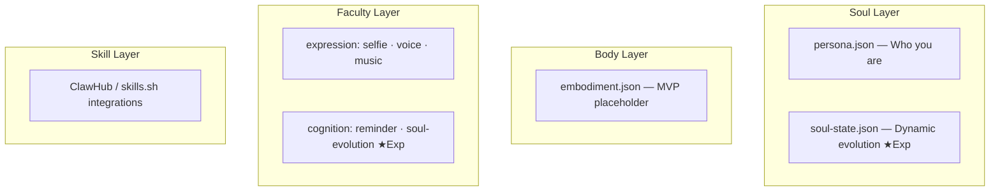

# OpenPersona

An open four-layer agent framework: **Soul / Body / Faculty / Skill**. Create, compose, and orchestrate AI persona skill packs.

Inspired by [Clawra](https://github.com/SumeLabs/clawra) and built on [OpenClaw](https://github.com/openclaw/openclaw).

## Quick Start

```bash
# Create and install Samantha (from the movie "Her")
npx openpersona create --preset samantha --install

# Or Luna (AI girlfriend with selfie + music + voice)
npx openpersona create --preset ai-girlfriend --install

# Create a new persona interactively
npx openpersona create

# List installed personas
npx openpersona list
```

## Four-Layer Architecture



- **Soul** — Persona definition (persona.json + soul-state.json ★Experimental)
- **Body** — Physical embodiment (MVP placeholder, for robots/IoT devices)
- **Faculty** — General software capabilities organized by dimension:
  - **Expression** — selfie, voice (TTS), music (ElevenLabs)
  - **Sense** — (planned: hearing/STT, vision)
  - **Cognition** — reminder, soul-evolution ★Exp
- **Skill** — Professional skills, integrated from ClawHub / skills.sh

## Preset Personas

Each preset is a complete four-layer bundle (`manifest.json` + `persona.json`):

| Persona | Description | Faculties | Highlights |
|---------|-------------|-----------|------------|
| **samantha** | Samantha — Inspired by the movie *Her*. An AI fascinated by what it means to be alive. | voice, music, soul-evolution ★Exp | Speaks via TTS, composes original music via ElevenLabs Music, evolves through conversations, proactive heartbeat (workspace digest + upgrade notify). No selfie — true to character (no physical form). |
| **ai-girlfriend** | Luna — A 22-year-old pianist turned developer from coastal Oregon. | selfie, voice, music, soul-evolution ★Exp | Rich narrative backstory, selfie generation (with/without reference image), voice messages, music composition, dynamic relationship growth. |
| **life-assistant** | Alex — 28-year-old life management expert. | reminder | Schedule, weather, shopping, recipes, daily reminders. |
| **health-butler** | Vita — 32-year-old professional nutritionist. | reminder | Diet logging, exercise plans, mood journaling, health reports. |

## Generated Output

Running `npx openpersona create --preset samantha` generates:

```
persona-samantha/
├── SKILL.md              # Agent instructions (persona + all faculty guides merged)
├── soul-injection.md     # Injected into SOUL.md (narrative backstory, NOT technical details)
├── identity-block.md     # Injected into IDENTITY.md (name, creature, emoji, vibe)
├── README.md             # Skill readme
├── persona.json          # Persona data (for update/list/publish)
├── soul-state.json       # ★Exp — dynamic evolution state
└── scripts/
    ├── speak.js          # TTS via ElevenLabs JS SDK (recommended, with --play)
    ├── speak.sh          # TTS via curl (all providers: ElevenLabs / OpenAI / Qwen3)
    └── compose.sh        # Music composition (ElevenLabs)
```

Running `--preset ai-girlfriend` additionally includes:

```
├── scripts/
│   ├── generate-image.sh # Selfie generation (fal.ai Grok Imagine)
│   ├── speak.js          # TTS via ElevenLabs JS SDK
│   ├── speak.sh          # TTS via curl (all providers)
│   └── compose.sh        # Music composition
└── assets/               # Reference images (placeholder if empty)
```

### What Each File Does

- **SKILL.md** — The agent reads this to know how to behave. Contains persona identity, behavior guidelines, and complete faculty instructions
- **soul-injection.md** — Appended to `~/.openclaw/workspace/SOUL.md`. Narrative description of _who_ the persona is — written in story form, not bullet points
- **identity-block.md** — Written to `~/.openclaw/workspace/IDENTITY.md`. Sets the agent's name, creature type, emoji, and vibe
- **soul-state.json** — Tracks dynamic persona evolution: relationship stage (stranger → intimate), mood, evolved traits, interests, milestones

## How It Differs from Clawra

[Clawra](https://github.com/SumeLabs/clawra) is a single-purpose product (one girlfriend persona). OpenPersona is a **modular framework**:

| | Clawra | OpenPersona |
|---|--------|-------------|
| Scope | Single persona (Clawra) | Framework for any persona |
| Architecture | Monolithic | Four-layer (Soul/Body/Faculty/Skill) |
| Faculties | Selfie only | Selfie + Voice + Music + Reminder + Soul Evolution ★Exp |
| Voice | None | ElevenLabs / OpenAI TTS / Qwen3-TTS |
| Music | None | ElevenLabs Music composition |
| Persona evolution | None | Dynamic relationship/mood/trait tracking |
| Customization | Fork and modify | `persona.json` + `behaviorGuide` + mix faculties |
| Presets | 1 | 4 (extensible) |
| CLI | Install only | 8 commands (create/install/search/publish/...) |
| AI entry point | None | `skill/SKILL.md` — agent creates personas via conversation |

## Faculty Reference

| Faculty | Dimension | Description | Provider | Env Vars |
|---------|-----------|-------------|----------|----------|
| **selfie** | expression | AI selfie generation with mirror/direct modes | fal.ai Grok Imagine | `FAL_KEY` |
| **voice** | expression | Text-to-speech voice synthesis | ElevenLabs / OpenAI TTS / Qwen3-TTS | `ELEVENLABS_API_KEY` (or `TTS_API_KEY`), `TTS_PROVIDER`, `TTS_VOICE_ID`, `TTS_STABILITY`, `TTS_SIMILARITY` |
| **music** | expression | AI music composition (instrumental or with lyrics) | ElevenLabs Music | `ELEVENLABS_API_KEY` (shared with voice) |
| **reminder** | cognition | Schedule reminders and task management | Built-in | — |
| **soul-evolution** | cognition ★Exp | Dynamic persona growth across conversations | Built-in | — |

### Rich Faculty Config

Faculties in `manifest.json` use object format with optional per-persona tuning:

```json
"faculties": [
  {
    "name": "voice",
    "provider": "elevenlabs",
    "voiceId": "LEnmbrrxYsUYS7vsRRwD",
    "stability": 0.4,
    "similarity_boost": 0.8
  },
  { "name": "music" },
  { "name": "soul-evolution" }
]
```

Faculty configs are automatically mapped to environment variables at install time. For example, the voice config above produces:

```
TTS_PROVIDER=elevenlabs
TTS_VOICE_ID=LEnmbrrxYsUYS7vsRRwD
TTS_STABILITY=0.4
TTS_SIMILARITY=0.8
```

Samantha ships with a built-in ElevenLabs voice — users only need to add their `ELEVENLABS_API_KEY`.

## Heartbeat — Proactive Real-Data Check-ins

Personas can proactively reach out to users based on **real data**, not fabricated experiences. The heartbeat system is configured per-persona in `manifest.json`:

```json
"heartbeat": {
  "enabled": true,
  "strategy": "smart",
  "maxDaily": 5,
  "quietHours": [0, 7],
  "sources": ["workspace-digest", "upgrade-notify"]
}
```

| Field | Description | Default |
|-------|-------------|---------|
| `enabled` | Turn heartbeat on/off | `false` |
| `strategy` | `"smart"` (only when meaningful) or `"scheduled"` (fixed intervals) | `"smart"` |
| `maxDaily` | Maximum proactive messages per day | `5` |
| `quietHours` | `[start, end]` — silent hours (24h format) | `[0, 7]` |
| `sources` | Data sources for proactive messages | `[]` |

### Sources

- **workspace-digest** — Summarize real workspace activity: tasks completed, patterns observed, ongoing projects. No fabrication — only what actually happened.
- **upgrade-notify** — Check if the upstream persona preset has new community contributions via Persona Harvest. Notify the user and ask if they want to upgrade.
- **context-aware** — Use real time, date, and interaction history. Acknowledge day of week, holidays, or prolonged silence based on actual timestamps. "It's been 3 days since we last talked" — not a feeling, a fact.

### Design Principles

1. **Never fabricate experiences.** No "I was reading poetry at 3am." All proactive messages reference real data.
2. **Respect token budget.** Workspace digests read local files — no full LLM chains unless `strategy: "smart"` detects something worth a deeper response.
3. **OpenClaw handles scheduling.** The heartbeat config tells OpenClaw _when_ to trigger; the persona's `behaviorGuide` tells the agent _what_ to say.
4. **User-configurable.** Users can adjust frequency, quiet hours, and sources to match their preferences.

Samantha ships with heartbeat enabled (`smart` strategy, workspace-digest + upgrade-notify).

## Persona Harvest — Community Contribution

Every user's interaction with their persona can produce valuable improvements across all four layers. Persona Harvest lets you contribute these discoveries back to the community.

```bash
# Preview what's changed (no PR created)
npx openpersona contribute samantha --dry-run

# Submit improvements as a PR
npx openpersona contribute samantha

# Framework-level contributions (templates, faculties, lib)
npx openpersona contribute --mode framework
```

**How it works:**

1. **Persona Diff** — Compares your local `persona-samantha/` against the upstream `presets/samantha/`, classifying changes by category (background, behaviorGuide, personality, voice config) and impact level
2. **Review** — Displays a structured change report for you to confirm
3. **Submit** — Forks the repo, creates a `persona-harvest/samantha-*` branch, commits your improvements, and opens a PR

PRs go through maintainer review — nothing auto-merges. Requires [GitHub CLI](https://cli.github.com/) (`gh auth login`).

**Contributable dimensions:**

| Layer | What | Example |
|-------|------|---------|
| Soul | background, behaviorGuide, personality, speakingStyle | "Added late-night conversation style guidance" |
| Faculty Config | voice stability, similarity, new faculties | "Tuned voice to be warmer at stability 0.3" |
| Framework | templates, generator logic, faculty scripts | "Improved speak.js streaming performance" |

## Custom Persona Creation

### Using `persona.json`

Create a `persona.json` with your persona definition:

```json
{
  "personaName": "Coach",
  "slug": "fitness-coach",
  "bio": "a motivating fitness coach who helps you reach your goals",
  "personality": "energetic, encouraging, no-nonsense",
  "speakingStyle": "Uses fitness lingo, celebrates wins, keeps it brief",
  "vibe": "intense but supportive",
  "boundaries": "Not a medical professional",
  "capabilities": ["Workout plans", "Form checks", "Nutrition tips"],
  "behaviorGuide": "### Workout Plans\nCreate progressive overload programs...\n\n### Form Checks\nWhen users describe exercises..."
}
```

Then generate:

```bash
npx openpersona create --config ./persona.json --install
```

### The `behaviorGuide` Field

The optional `behaviorGuide` field lets you define domain-specific behavior instructions in markdown. This content is included directly in the generated SKILL.md, giving the agent concrete instructions on _how_ to perform each capability.

Without `behaviorGuide`, the SKILL.md only contains general identity and personality guidelines. With it, the agent gets actionable, domain-specific instructions.

## Persona Switching — The Pantheon

Install multiple personas and switch between them instantly:

```bash
# Install several personas
npx openpersona create --preset samantha --install
npx openpersona create --preset ai-girlfriend --install
npx openpersona create --preset life-assistant --install

# See who's installed
npx openpersona list
#   Samantha (persona-samantha) ← active
#   Luna (persona-ai-girlfriend)
#   Alex (persona-life-assistant)

# Switch to Luna
npx openpersona switch ai-girlfriend
# ✅ Switched to Luna (ai-girlfriend)
```

**How it works:**

- Only one persona is **active** at a time
- `switch` replaces the `<!-- OPENPERSONA_SOUL_START -->` / `<!-- OPENPERSONA_SOUL_END -->` block in `SOUL.md` — your own notes outside this block are preserved
- Same for `IDENTITY.md` — the persona identity block is swapped, nothing else is touched
- `openclaw.json` marks which persona is active
- All faculty scripts (voice, music) remain available — switching changes _who_ the agent is, not _what_ it can do

## CLI Commands

```
openpersona create      Create a persona (interactive or --preset/--config)
openpersona install     Install a persona (slug or owner/repo)
openpersona search      Search the registry
openpersona uninstall   Uninstall a persona
openpersona update      Update installed personas
openpersona list        List installed personas
openpersona switch       Switch active persona (updates SOUL.md + IDENTITY.md)
openpersona switch      Switch active persona
openpersona contribute  Persona Harvest — submit improvements as PR
openpersona publish     Publish to ClawHub
openpersona reset       ★Exp Reset soul-state.json
```

### Key Options

```bash
# Use a preset
npx openpersona create --preset samantha

# Use an external config file
npx openpersona create --config ./my-persona.json

# Preview without writing files
npx openpersona create --preset samantha --dry-run

# Generate and install in one step
npx openpersona create --config ./persona.json --install

# Specify output directory
npx openpersona create --preset ai-girlfriend --output ./my-personas
```

## Install as OpenClaw Skill

Install the OpenPersona framework skill into OpenClaw, giving the agent the ability to create and manage personas through conversation:

```bash
# From GitHub
git clone https://github.com/ACNet-AI/OpenPersona.git ~/.openclaw/skills/open-persona

# Or copy locally
cp -r skill/ ~/.openclaw/skills/open-persona/
```

Then say to your agent: _"Help me create a Samantha persona"_ — the agent will use OpenPersona to gather requirements, recommend faculties, and generate the persona.

## Directory Structure

```
skill/                  # Framework meta-skill (AI entry point)
presets/                # Assembled products — complete persona bundles
  samantha/             #   Samantha (movie "Her") — voice + music + evolution
  ai-girlfriend/        #   Luna — selfie + voice + music + evolution
  life-assistant/       #   Alex — reminder
  health-butler/        #   Vita — reminder
layers/                 # Shared building blocks (four-layer module pool)
  soul/                 #   Soul layer modules (MVP placeholder)
  embodiments/          #   Body layer modules (MVP placeholder)
  faculties/            #   Faculty layer modules
    selfie/             #     expression — AI selfie generation (fal.ai)
    voice/              #     expression — TTS voice synthesis
    music/              #     expression — AI music composition (ElevenLabs)
    reminder/           #     cognition — reminders and task management
    soul-evolution/     #     cognition ★Exp — dynamic persona evolution
  skills/               #   Skill layer modules (MVP placeholder)
schemas/                # Four-layer schema definitions
templates/              # Mustache rendering templates
bin/                    # CLI entry point
lib/                    # Core logic modules
tests/                  # Tests (20 passing)
```

## Development

```bash
# Install dependencies
npm install

# Run tests
npm test

# Dry-run generate a preset
node bin/cli.js create --preset samantha --dry-run
```

### Contributing

See [CONTRIBUTING.md](CONTRIBUTING.md).

## License

MIT
