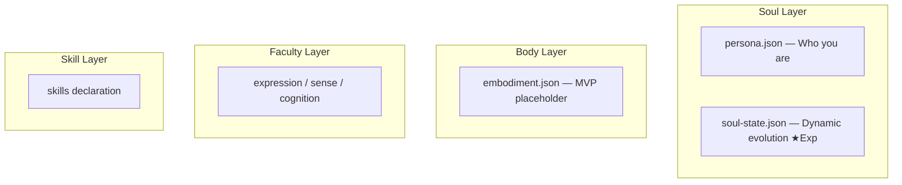

# OpenPersona

An open four-layer agent framework: **Soul / Body / Faculty / Skill**. Create, manage, and orchestrate AI persona skill packs.

Inspired by [Clawra](https://github.com/SumeLabs/clawra) and built on [OpenClaw](https://github.com/openclaw/openclaw).

## Quick Start

```bash
# Create and install using a preset persona
npx openpersona create --preset ai-girlfriend --install

# Or create a new persona interactively
npx openpersona create

# List installed personas
npx openpersona list
```

## Four-Layer Architecture



- **Soul** — Persona definition (persona.json + soul-state.json ★Experimental)
- **Body** — Physical embodiment (MVP placeholder, no implementation)
- **Faculty** — General software capabilities: expression / sense / cognition
- **Skill** — Professional skills, integrated from ClawHub / skills.sh

## Preset Personas

Each preset is a complete four-layer bundle (`manifest.json` + `persona.json`):

| Persona | Description | Faculty |
|---------|-------------|---------|
| ai-girlfriend | Luna — Gentle, cute, caring AI companion | selfie, soul-evolution ★Exp |
| life-assistant | Alex — 28-year-old life management expert | reminder |
| health-butler | Vita — 32-year-old professional nutritionist | reminder |

## CLI Commands

```
openpersona create    Create a persona (interactive or --preset/--config)
openpersona install   Install a persona (slug or owner/repo)
openpersona search    Search the registry
openpersona uninstall Uninstall a persona
openpersona update    Update installed personas
openpersona list      List installed personas
openpersona publish   Publish to ClawHub
openpersona reset     ★Exp Reset soul-state.json
```

## Install OpenPersona Skill (AI Entry Point)

Install the OpenPersona skill itself into OpenClaw, giving the agent the ability to create personas:

```bash
cp -r skill/ ~/.openclaw/skills/open-persona/
```

## Directory Structure

```
skill/                  # Framework meta-skill (AI entry point)
presets/                # Assembled products — complete persona bundles
  ai-girlfriend/        #   manifest.json (4-layer manifest) + persona.json (soul)
  life-assistant/
  health-butler/
layers/                 # Shared building blocks (four-layer module pool)
  soul/                 #   Soul layer modules (MVP placeholder: fragments, mixins)
  embodiments/          #   Body layer modules (MVP placeholder)
  faculties/            #   Faculty layer modules (selfie, reminder, soul-evolution)
  skills/               #   Skill layer modules (MVP placeholder: templates, bundles)
schemas/                # Four-layer schema definitions (soul/body/faculty/skill)
templates/              # Mustache rendering templates
bin/                    # CLI entry point
lib/                    # Core logic modules
tests/                  # Tests
```

## Development

### Body Layer (Physical Embodiment)

See `layers/embodiments/README.md`, schema at `schemas/body/embodiment.schema.json`.

### Faculty Layer

See `layers/faculties/`. MVP presets: selfie, reminder, soul-evolution (★Exp).

### Contributing

See [CONTRIBUTING.md](CONTRIBUTING.md).

## License

MIT
