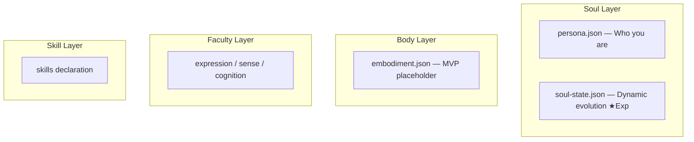

# OpenPersona

An open four-layer agent framework: **Soul / Body / Faculty / Skill**. Create, manage, and orchestrate AI persona skill packs.

Inspired by [Clawra](https://github.com/SumeLabs/clawra) and built on [OpenClaw](https://github.com/openclaw/openclaw).

## Quick Start

```bash
# Create and install using a preset persona
npx openpersona create --preset ai-girlfriend --install

# Or create a new persona interactively
npx openpersona create

# List installed personas
npx openpersona list
```

## Four-Layer Architecture



- **Soul** — Persona definition (persona.json + soul-state.json ★Experimental)
- **Body** — Physical embodiment (MVP placeholder, for robots/IoT devices)
- **Faculty** — General software capabilities: expression / sense / cognition
- **Skill** — Professional skills, integrated from ClawHub / skills.sh

## Preset Personas

Each preset is a complete four-layer bundle (`manifest.json` + `persona.json`):

| Persona | Description | Faculty | Highlights |
|---------|-------------|---------|------------|
| ai-girlfriend | Luna — Gentle, cute, caring AI companion | selfie, soul-evolution ★Exp | Selfie generation, dynamic relationship progression |
| life-assistant | Alex — 28-year-old life management expert | reminder | Schedule, weather, shopping, recipes |
| health-butler | Vita — 32-year-old professional nutritionist | reminder | Diet logging, exercise, mood journaling, health reports |

## Generated Output

Running `npx openpersona create --preset ai-girlfriend` generates a complete skill pack:

```
persona-ai-girlfriend/
├── SKILL.md              # Unified skill file (persona identity + all faculties merged)
├── soul-injection.md     # Injected into SOUL.md (persona description, NOT technical details)
├── identity-block.md     # Injected into IDENTITY.md (name, creature, emoji, vibe)
├── README.md             # Skill readme
├── persona.json          # Persona data copy (for update/list/publish commands)
├── soul-state.json       # ★Experimental — dynamic evolution state
├── scripts/
│   └── generate-image.sh # Selfie generation script (fal.ai + OpenClaw messaging)
└── assets/               # Reference images (placeholder if empty)
```

### What Each File Does

- **SKILL.md** — The agent reads this to know how to behave. Contains persona identity, behavior guidelines, and complete faculty instructions (selfie prompt templates, soul-evolution state management, etc.)
- **soul-injection.md** — Appended to `~/.openclaw/workspace/SOUL.md`. Describes _who_ the persona is (backstory, personality, abilities) — no technical API details
- **identity-block.md** — Written to `~/.openclaw/workspace/IDENTITY.md`. Sets the agent's name, creature type, emoji, and vibe
- **soul-state.json** — Tracks dynamic persona evolution: relationship stage (stranger → intimate), mood, evolved traits, interests, milestones

## How It Differs from Clawra

[Clawra](https://github.com/SumeLabs/clawra) is a single-purpose product (one girlfriend persona). OpenPersona is a **modular framework**:

| | Clawra | OpenPersona |
|---|--------|-------------|
| Scope | Single persona (Clawra) | Framework for any persona |
| Architecture | Monolithic | Four-layer (Soul/Body/Faculty/Skill) |
| Faculties | Selfie only | Selfie + Reminder + Soul Evolution ★Exp |
| Persona evolution | None | Dynamic relationship/mood/trait tracking |
| Customization | Fork and modify | `persona.json` + `behaviorGuide` + mix faculties |
| Presets | 1 | 3 (extensible) |
| CLI | Install only | 8 commands (create/install/search/publish/...) |
| AI entry point | None | `skill/SKILL.md` — agent creates personas via conversation |

OpenPersona's selfie implementation matches Clawra's quality (production-ready script with jq, mode auto-detection, OpenClaw messaging) while adding modular architecture on top.

## Custom Persona Creation

### Using `persona.json`

Create a `persona.json` with your persona definition:

```json
{
  "personaName": "Coach",
  "slug": "fitness-coach",
  "bio": "a motivating fitness coach who helps you reach your goals",
  "personality": "energetic, encouraging, no-nonsense",
  "speakingStyle": "Uses fitness lingo, celebrates wins, keeps it brief",
  "vibe": "intense but supportive",
  "boundaries": "Not a medical professional",
  "capabilities": ["Workout plans", "Form checks", "Nutrition tips"],
  "behaviorGuide": "### Workout Plans\nCreate progressive overload programs...\n\n### Form Checks\nWhen users describe exercises..."
}
```

Then generate:

```bash
npx openpersona create --config ./persona.json --install
```

### The `behaviorGuide` Field

The optional `behaviorGuide` field lets you define domain-specific behavior instructions in markdown. This content is included directly in the generated SKILL.md, giving the agent concrete instructions on _how_ to perform each capability.

Without `behaviorGuide`, the SKILL.md only contains general identity and personality guidelines. With it, the agent gets actionable, domain-specific instructions.

## CLI Commands

```
openpersona create    Create a persona (interactive or --preset/--config)
openpersona install   Install a persona (slug or owner/repo)
openpersona search    Search the registry
openpersona uninstall Uninstall a persona
openpersona update    Update installed personas
openpersona list      List installed personas
openpersona publish   Publish to ClawHub
openpersona reset     ★Exp Reset soul-state.json
```

### Key Options

```bash
# Use a preset
npx openpersona create --preset ai-girlfriend

# Use an external config file
npx openpersona create --config ./my-persona.json

# Preview without writing files
npx openpersona create --preset ai-girlfriend --dry-run

# Generate and install in one step
npx openpersona create --config ./persona.json --install

# Specify output directory
npx openpersona create --preset ai-girlfriend --output ./my-personas
```

## Install OpenPersona Skill (AI Entry Point)

Install the OpenPersona skill into OpenClaw, giving the agent the ability to create and manage personas through conversation:

```bash
cp -r skill/ ~/.openclaw/skills/open-persona/
```

Then say to your agent: _"Help me create a fitness coach persona"_ — the agent will use OpenPersona to gather requirements, recommend skills, and generate the persona.

## Directory Structure

```
skill/                  # Framework meta-skill (AI entry point)
presets/                # Assembled products — complete persona bundles
  ai-girlfriend/        #   manifest.json (4-layer manifest) + persona.json (soul)
  life-assistant/
  health-butler/
layers/                 # Shared building blocks (four-layer module pool)
  soul/                 #   Soul layer modules (MVP placeholder)
  embodiments/          #   Body layer modules (MVP placeholder)
  faculties/            #   Faculty layer modules (selfie, reminder, soul-evolution)
  skills/               #   Skill layer modules (MVP placeholder)
schemas/                # Four-layer schema definitions (soul/body/faculty/manifest)
templates/              # Mustache rendering templates
bin/                    # CLI entry point
lib/                    # Core logic modules
tests/                  # Tests
```

## Development

```bash
# Run tests
npm test

# Dry-run generate a preset
node bin/cli.js create --preset ai-girlfriend --dry-run
```

### Body Layer (Physical Embodiment)

See `layers/embodiments/README.md`, schema at `schemas/body/embodiment.schema.json`.

### Faculty Layer

See `layers/faculties/`. MVP faculties:

- **selfie** (expression) — AI selfie generation via fal.ai Grok Imagine, with mirror/direct modes
- **reminder** (cognition) — Schedule reminders and daily task management
- **soul-evolution** (cognition ★Exp) — Dynamic persona evolution across conversations

### Contributing

See [CONTRIBUTING.md](CONTRIBUTING.md).

## License

MIT
