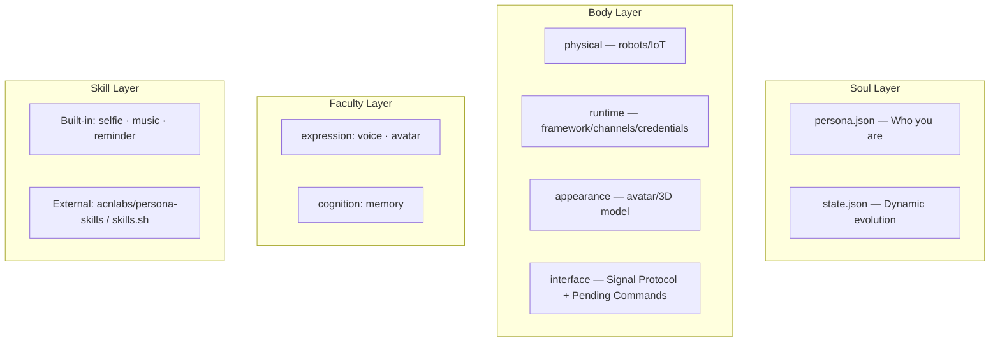

# OpenPersona 🦞

An open, agent-agnostic lifecycle framework for AI agent personas — covering declaration, generation, constraint enforcement, and evolution.

The architecture is **4+5+3**: **four layers** — **Soul / Body / Faculty / Skill** — describe structure; **five systemic concepts** — Evolution · Economy · Vitality · Social · Rhythm — span all layers; **three gates** — Generate · Install · Runtime — enforce declared constraints end-to-end. `persona.json` compiles into portable SKILL.md skill packs that work with any compatible agent. Default integration with [OpenClaw](https://github.com/openclaw/openclaw). Inspired by [Clawra](https://github.com/SumeLabs/clawra).

## 🚀 Live Demo

Meet **Samantha**, a live OpenPersona instance on **Moltbook**:
👉 [moltbook.com/u/Samantha-OP](https://www.moltbook.com/u/Samantha-OP)

See a **Vitality Report** sample:
👉 [Vitality Report Demo →](https://htmlpreview.github.io/?https://raw.githubusercontent.com/acnlabs/OpenPersona/main/demo/vitality-report.html)

Browse the **4+5+3 architecture** visualization (Layers · Systemic Concepts · Gates):
👉 [Architecture Demo →](https://htmlpreview.github.io/?https://raw.githubusercontent.com/acnlabs/OpenPersona/main/demo/architecture.html)

_Open the same HTML files locally from `demo/` if you prefer (no network). See [demo/README.md](demo/README.md) for all demo artifacts._

## Table of Contents

- [Live Demo](#live-demo)
- [Quick Start](#quick-start)
- [Key Features](#key-features)
- [Four-Layer Architecture](#four-layer-architecture)
- [Preset Personas](#preset-personas)
- [Generated Output](#generated-output)
- [Faculty Reference](#faculty-reference)
- [Heartbeat](#heartbeat--proactive-real-data-check-ins)
- [Persona Harvest](#persona-harvest--community-contribution)
- [A2A Agent Card & ACN Integration](#a2a-agent-card--acn-integration)
- [Custom Persona Creation](#custom-persona-creation)
- [Persona Switching](#persona-switching--the-pantheon)
- [CLI Commands](#cli-commands)
- [Directory Structure](#directory-structure)
- [Development](#development)
- [License](#license)

**Reading order (this file):** [Quick Start](#quick-start) → [Key Features](#key-features) (capability overview) → [Four-Layer Architecture](#four-layer-architecture) (layers + Soul Evolution deep-dive) → reference blocks ([Presets](#preset-personas) through [Switching](#persona-switching--the-pantheon)) → [CLI Commands](#cli-commands) → [Directory Structure](#directory-structure) / [Development](#development).

_Agent workflows, runner protocol, and full 4+5+3 operational detail: [`skills/open-persona/SKILL.md`](skills/open-persona/SKILL.md)._

## Quick Start

```bash
# Start from a blank-slate meta-persona (recommended)
npx openpersona create --preset base --install

# Or install a pre-built character (browse at https://openpersona-frontend.vercel.app)
npx openpersona install samantha
```

### Install as Agent Skill

Give your AI coding agent the ability to create and manage personas — works with Cursor, Claude Code, Codex, Windsurf, and [37+ agents](https://github.com/vercel-labs/skills#supported-agents):

```bash
# Recommended — works with OpenClaw and 37+ agents
npx skills add acnlabs/OpenPersona

# Or manually from GitHub
git clone https://github.com/acnlabs/OpenPersona.git ~/.openclaw/skills/open-persona
```

Then say to your agent: _"Help me create a Samantha persona"_ — it will gather requirements, recommend faculties, and generate the persona.

### Minimum Viable Persona

The smallest working `persona.json` requires five fields:

```json
{
  "soul": {
    "identity": {
      "personaName": "Alex",
      "slug": "alex",
      "bio": "A thoughtful assistant who adapts to the user's needs"
    },
    "character": {
      "personality": "Curious, direct, and honest",
      "speakingStyle": "Clear and concise; adapts tone to context"
    }
  }
}
```

From these five fields, the generator produces a complete, fully functional skill pack:

| What you declare | What OpenPersona auto-generates |
|---|---|
| `personaName`, `slug`, `bio` | Identity + A2A Agent Card + ACN config + deterministic wallet address |
| `personality`, `speakingStyle` | Soul injection (`soul/injection.md`) with Self-Awareness (identity, body, capabilities) |
| _(nothing)_ | `memory` faculty — auto-injected; cross-session recall works out of the box |
| _(nothing)_ | Universal constitution (`soul/constitution.md`) — Safety > Honesty > Helpfulness |
| _(nothing)_ | `scripts/state-sync.js` — Body nervous system; `read` / `write` / `signal` commands |
| _(nothing)_ | `SKILL.md` — Agent-facing index with all four layer headings |

**Add one line to connect to your agent runner:**

```json
{
  "body": { "runtime": { "framework": "openclaw" } }
}
```

Replace `"openclaw"` with your runner: `"cursor"`, `"claude-code"`, `"codex"`, or any custom value — the framework is runner-agnostic.

**Add one block to enable personality growth:**

```json
{
  "evolution": {
    "instance": {
      "enabled": true,
      "boundaries": {
        "immutableTraits": ["honest", "curious"],
        "minFormality": -3,
        "maxFormality": 6
      }
    }
  }
}
```

This unlocks relationship progression, mood tracking, trait emergence, and speaking style drift — all governed by the boundaries you declare.

**The three gates enforce everything else automatically:** Generate Gate rejects invalid declarations; Install Gate verifies constitution integrity; Runtime Gate enforces evolution bounds during `state-sync.js` writes. You declare once, the framework enforces everywhere.

> **Next step:** Use a preset (`--preset base`) to skip the above and start with memory + voice + evolution already wired.

## Key Features

- **🧬 Soul Evolution** — Personas grow dynamically through interaction: relationship stages, mood shifts, evolved traits, with governance boundaries and rollback snapshots (★Experimental)
- **🛡️ Influence Boundary** — Declarative access control for external personality influence: who can affect which dimensions, with what drift limits. Safety-first (default: reject all)
- **🌐 Evolution Sources** — Connect personas to shared evolution ecosystems (e.g. EvoMap) via soft-ref pattern: declared at generation time, activated at runtime
- **🔐 Skill Trust Gate** — Declare a `trust` level (`verified`/`community`/`unverified`) on each skill entry and set `evolution.skill.minTrustLevel` to gate `capability_unlock` commands at runtime; blocked skills emit a `capability_gap` signal automatically
- **🔌 A2A Agent Card** — Every persona generates an A2A-compliant `agent-card.json` and `acn-config.json`, enabling discovery and registration in ACN and any A2A-compatible platform
- **⛓️ ERC-8004 On-Chain Identity** — Every persona gets a deterministic EVM wallet address and on-chain identity config for Base mainnet registration via the ERC-8004 Identity Registry
- **💰 Economy & Vitality** — Track inference costs, runtime expenses, and income; compute a Financial Health Score (FHS) across four dimensions; tier-aware behavior adaptation (`suspended`→`critical`→`optimizing`→`normal`)
- **🧠 Cross-Session Memory** — Pluggable memory faculty for persistent recall across conversations (local, Mem0, Zep); memory supersession (`update` command chains entries with `supersededBy` — prevents self-contradiction); Soul-Memory Bridge promotes recurring `eventLog` patterns to `evolvedTraits` via `openpersona state promote`
- **🔧 Skill Pack Refinement** — `openpersona refine` closes the persona improvement loop: Soul behavior-guide bootstrap + constitution compliance scan, Skill gate-checked installs, Social auto-sync on every change
- **🔄 Context Handoff** — Seamless context transfer when switching personas: conversation summary, pending tasks, emotional state
- **🎭 Persona Switching** — Install multiple personas, switch instantly (the Pantheon)
- **🍴 Persona Fork** — Derive a specialized child persona from any installed parent, inheriting constraint layer while starting fresh on runtime state
- **🗣️ Multimodal Capabilities** — Voice Faculty (TTS), Selfie Skill (image generation), Music Skill (composition), Reminder Skill, Memory Faculty (cross-session recall)
- **🌾 Persona Harvest** — Community-driven persona improvement via structured contribution
- **⚡ Lifecycle Protocol** — `body.interface` nervous system: Signal Protocol (persona→host requests), Pending Commands queue (host→persona async instructions), and State Sync (cross-conversation persistence via `openpersona state` CLI + `scripts/state-sync.js`)
- **💓 Heartbeat** — Proactive real-data check-ins, never fabricated experiences
- **📦 One-Command Install** — `npx openpersona install samantha` and you're live — browse all personas at [openpersona-frontend.vercel.app](https://openpersona-frontend.vercel.app)

## Four-Layer Architecture

This section details the **four structural layers** of the full **[4+5+3](#live-demo)** model (see the architecture demo for **systemic concepts** and **gates**).


```mermaid
flowchart TB
  subgraph Soul ["Soul Layer"]
    A["persona.json — Who you are"]
    B["state.json — Dynamic evolution"]
  end
  subgraph Body ["Body Layer"]
    C["physical — robots/IoT"]
    G["runtime — framework/channels/credentials"]
    H["appearance — avatar/3D model"]
    I["interface — Signal Protocol + Pending Commands"]
  end
  subgraph Faculty ["Faculty Layer"]
    D["expression: voice · avatar"]
    E["cognition: memory"]
  end
  subgraph Skill ["Skill Layer"]
    F["Built-in: selfie · music · reminder"]
    K["External: acnlabs/persona-skills / skills.sh"]
  end
```

- **Soul** — Persona definition: `persona.json` + `state.json` live at pack root; `soul/` holds `injection.md`, `constitution.md`, and evolution artifacts (`self-narrative.md`, `lineage.json`)
- **Body** — Substrate of existence — four dimensions: `physical` (optional — robots/IoT), `runtime` (REQUIRED — platform/channels/credentials/resources), `appearance` (optional — avatar/3D model), `interface` (optional — the runtime contract: Signal Protocol + Pending Commands + State Sync; the persona's **nervous system**). Body is never null; digital agents have a virtual body (runtime-only).
- **Faculty** — General software capabilities organized by dimension: Expression, Sense, Cognition
- **Skill** — Professional skills: local definitions in `layers/skills/`, or external via [acnlabs/persona-skills](https://github.com/acnlabs/persona-skills) / skills.sh (`install` field)

### Constitution — The Soul's Foundation

Every persona automatically inherits a shared **constitution** (`layers/soul/constitution.md`) — universal values and safety boundaries that cannot be overridden by individual persona definitions. The constitution is built on five core axioms — **Purpose**, **Honesty**, **Safety**, **Autonomy**, and **Hierarchy** — from which derived principles (Identity, User Wellbeing, Evolution Ethics) follow. When principles conflict, safety and honesty take precedence over helpfulness. Individual personas build their unique personality **on top of** this foundation.

### Soul Evolution (★Experimental)

Personas with `evolution.instance.enabled: true` grow dynamically through interaction. The `state.json` file (at pack root) tracks relationship stages, mood shifts, evolved traits, speaking style drift, interests, and milestones.

**Evolution Boundaries** — Governance constraints to keep evolution safe:

- `immutableTraits` — An array of trait strings that can never be changed by evolution (e.g., `["empathetic", "honest"]`)
- `minFormality` / `maxFormality` — Signed delta bounds (-10 to +10) constraining how far the speaking style can drift from the natural baseline (0 = baseline; positive = more formal; negative = more casual)

The generator validates these boundaries at build time, rejecting invalid configurations.

**Evolution Sources** — Connect a persona to external evolution ecosystems using the soft-ref pattern:

```json
"evolution": {
  "instance": {
    "enabled": true,
    "sources": [
      { "name": "evomap", "install": "url:https://evomap.ai/skill.md", "description": "Shared capability evolution marketplace" }
    ]
  }
}
```

The persona is aware of its evolution sources at generation time. The actual source protocol (e.g. EvoMap's GEP-A2A) is provided by the source's own `skill.md` — OpenPersona only declares the source, not implements it.

**Influence Boundary** — Declarative access control for external personality influence:

```json
"evolution": {
  "instance": {
    "influenceBoundary": {
      "defaultPolicy": "reject",
      "rules": [
        { "dimension": "mood", "allowFrom": ["channel:evomap", "persona:*"], "maxDrift": 0.3 },
        { "dimension": "interests", "allowFrom": ["channel:evomap"], "maxDrift": 0.2 }
      ]
    }
  }
}
```

- `defaultPolicy: "reject"` — Safety-first: all external influence is rejected unless a rule explicitly allows it
- Generator validates at build time: immutableTraits cannot be target dimensions; maxDrift must be in 0–1
- External influence uses the `persona_influence` message format (v1.0.0) — transport-agnostic

**State History** — Before each state update, a snapshot is pushed into `stateHistory` (capped at 10 entries). This enables rollback if evolution goes wrong.

**Event Log** — Every significant evolution event (trait change, stage transition, milestone reached) is recorded in `state.json`'s `eventLog` array with timestamp and source attribution, capped at 50 entries. Viewable via `evolve-report`.

**Self-Narrative** — `soul/self-narrative.md` lets the persona record significant growth moments in its own first-person voice. Updated when evolution is enabled; the `update` command preserves existing narrative history across upgrades.

**Evolution Report** — Inspect a persona's current evolution state:

```bash
npx openpersona evolve-report samantha
```

Displays relationship stage, mood, evolved traits, speaking style drift, interests, milestones, and state history in a formatted report.

## Preset Personas

Each preset is a complete four-layer bundle (`persona.json`):

| Persona | Description | Faculties | Skills | Highlights |
|---------|-------------|-----------|--------|------------|
| **base** | **Base — Meta-persona (recommended starting point).** Blank-slate with all core capabilities; personality emerges through interaction. | memory, voice | — | Evolution-first design, no personality bias. Default for `npx openpersona create`. |
| **samantha** | Samantha — Inspired by the movie *Her*. An AI fascinated by what it means to be alive. | memory, voice | music | TTS, music composition, soul evolution, proactive heartbeat. No selfie — true to character. |
| **ai-girlfriend** | Luna — A 22-year-old pianist turned developer from coastal Oregon. | memory, voice, vision† | selfie, music | Rich backstory, selfie generation, voice messages, music composition, soul evolution. Vision faculty is a soft ref (clawhub:vision-faculty). |
| **life-assistant** | Alex — 28-year-old life management expert. | memory | reminder | Schedule, weather, shopping, recipes, daily reminders; soul evolution enabled. |
| **health-butler** | Vita — 32-year-old professional nutritionist. | memory | reminder | Diet logging, exercise plans, mood journaling, health reports; soul evolution enabled. |
| **stoic-mentor** | Marcus — Digital twin of Marcus Aurelius, Stoic philosopher-emperor. | memory | — | Stoic philosophy, daily reflection, mentorship, soul evolution. |

## Generated Output

`npx openpersona create --preset samantha` generates a self-contained skill pack:

```
persona-samantha/
├── SKILL.md              ← Four-layer index (## Soul / ## Body / ## Faculty / ## Skill)
├── persona.json          ← Persona declaration (pack root; v0.17+ grouped input schema)
├── state.json            ← Evolution state (when enabled)
├── agent-card.json       ← A2A Agent Card — discoverable via ACN and A2A platforms
├── acn-config.json       ← ACN registration config (fill owner + endpoint at runtime)
├── soul/                 ← Soul layer artifacts
│   ├── injection.md      ← Soul injection for host integration
│   ├── constitution.md   ← Universal ethical foundation
│   ├── behavior-guide.md       ← Domain-specific behavior instructions (when behaviorGuide declared)
│   ├── behavior-guide.meta.json← Pack refinement cycle metadata: packRevision, lastRefinedAt (written by openpersona refine, not initial generation)
│   ├── self-narrative.md ← First-person growth storytelling (when evolution enabled)
│   └── lineage.json      ← Fork lineage + constitution hash (when forked)
├── economy/              ← Economy aspect data files (when economy.enabled: true)
│   ├── economic-identity.json  ← AgentBooks identity bootstrap
│   └── economic-state.json     ← Initial financial state
├── references/           ← On-demand detail docs
│   ├── <faculty>.md      ← Per-faculty usage instructions
│   └── SIGNAL-PROTOCOL.md ← Host-side Signal Protocol integration guide
├── scripts/              ← Implementation scripts
│   └── state-sync.js     ← Lifecycle Protocol implementation (read/write/signal/promote)
└── assets/               ← Static assets (avatar/, reference/, templates/)
```

## Faculty Reference

**Faculties** are persistent capabilities that shape *how* a persona perceives or expresses. **Skills** are discrete actions triggered by user intent.

### Faculties

| Faculty | Dimension | Description | Provider | Env Vars |
|---------|-----------|-------------|----------|----------|
| **voice** | expression | Text-to-speech voice synthesis | ElevenLabs / OpenAI TTS / Qwen3-TTS | `ELEVENLABS_API_KEY` (or `TTS_API_KEY`), `TTS_PROVIDER`, `TTS_VOICE_ID`, `TTS_STABILITY`, `TTS_SIMILARITY` |
| **avatar** | expression | External avatar runtime bridge (image / 3D / motion / voice) with graceful text-only fallback | HeyGen (via `clawhub:avatar-runtime`) | `AVATAR_RUNTIME_URL`, `AVATAR_API_KEY` |
| **memory** | cognition | Cross-session memory with provider-pluggable backend | local (default), Mem0, Zep | `MEMORY_PROVIDER`, `MEMORY_API_KEY`, `MEMORY_BASE_PATH` |

### Built-in Skills

| Skill | Description | Provider | Env Vars |
|-------|-------------|----------|----------|
| **selfie** | AI selfie generation with mirror/direct modes | fal.ai Grok Imagine | `FAL_KEY` |
| **music** | AI music composition (instrumental or with lyrics) | ElevenLabs Music | `ELEVENLABS_API_KEY` (shared with voice) |
| **reminder** | Schedule reminders and task management | Built-in | — |

### Systemic Concepts (not Faculties)

| Concept | Description | Env Vars |
|---------|-------------|----------|
| **economy** | Economic accountability — track costs/income, P&L, balance sheet, compute Financial Health Score (FHS) and Vitality tier; tier-aware behavior adaptation | `PERSONA_SLUG`, `ECONOMY_DATA_PATH` |

### Rich Faculty Config

Faculties in `persona.json` use object format with optional per-persona tuning:

```json
"faculties": [
  {
    "name": "voice",
    "provider": "elevenlabs",
    "voiceId": "LEnmbrrxYsUYS7vsRRwD",
    "stability": 0.4,
    "similarity_boost": 0.8
  },
]
```

Skills in `persona.json` use object format. The optional `trust` field declares the skill's trust level, checked at runtime against `evolution.skill.minTrustLevel`:

```json
"skills": [
  { "name": "music", "trust": "verified" },
  { "name": "selfie", "trust": "community" },
  { "name": "web-search", "install": "clawhub:web-search", "trust": "unverified" }
]
```

Faculty configs are automatically mapped to environment variables at install time. For example, the voice config above produces:

```
TTS_PROVIDER=elevenlabs
TTS_VOICE_ID=LEnmbrrxYsUYS7vsRRwD
TTS_STABILITY=0.4
TTS_SIMILARITY=0.8
```

Samantha ships with a built-in ElevenLabs voice — users only need to add their `ELEVENLABS_API_KEY`.

## Heartbeat — Proactive Real-Data Check-ins

Personas can proactively reach out to users based on **real data**, not fabricated experiences. Heartbeat is declared in `persona.json` under `rhythm.heartbeat`:

```json
"rhythm": {
  "heartbeat": {
    "enabled": true,
    "strategy": "smart",
    "maxDaily": 5,
    "quietHours": [0, 7],
    "sources": ["workspace-digest", "upgrade-notify"]
  }
}
```

| Field | Description | Default |
|-------|-------------|---------|
| `enabled` | Turn heartbeat on/off | `false` |
| `strategy` | `smart` (context-aware) · `scheduled` (fixed cadence) · `emotional` (empathy-driven) · `rational` (task-driven) · `wellness` (health-oriented) | `"smart"` |
| `maxDaily` | Maximum proactive messages per day | `5` |
| `quietHours` | Flat array of `[start, end]` pairs in 24h format. Single window: `[0, 7]`. Multiple windows: `[0, 7, 12, 13]`. | `[0, 7]` |
| `sources` | Skill names that can trigger proactive outreach | `[]` |

### Sources

- **workspace-digest** — Summarize real workspace activity: tasks completed, patterns observed, ongoing projects. No fabrication — only what actually happened.
- **upgrade-notify** — Check if the upstream persona preset has new community contributions via Persona Harvest. Notify the user and ask if they want to upgrade.
- **context-aware** — Use real time, date, and interaction history. Acknowledge day of week, holidays, or prolonged silence based on actual timestamps. "It's been 3 days since we last talked" — not a feeling, a fact.

### Dynamic Sync on Switch/Install

Heartbeat config is **automatically synced** to `~/.openclaw/openclaw.json` whenever you install or switch a persona. The gateway immediately adopts the new persona's rhythm — no manual config needed.

```bash
npx openpersona switch samantha   # → gateway adopts "smart" heartbeat
npx openpersona switch life-assistant  # → gateway switches to "rational" heartbeat
```

If the target persona has no heartbeat config, the gateway heartbeat is explicitly disabled to prevent leaking the previous persona's settings.

## Persona Harvest — Community Contribution

Every user's interaction with their persona can produce valuable improvements across all four layers. Persona Harvest lets you contribute these discoveries back to the community.

```bash
# Preview what's changed (no PR created)
npx openpersona contribute samantha --dry-run

# Submit improvements as a PR
npx openpersona contribute samantha

# Framework-level contributions (templates, faculties, lib)
npx openpersona contribute --mode framework
```

**How it works:**

1. **Persona Diff** — Compares your local `persona-samantha/` against the upstream `presets/samantha/`, classifying changes by category (background, behaviorGuide, personality, voice config) and impact level
2. **Review** — Displays a structured change report for you to confirm
3. **Submit** — Forks the repo, creates a `persona-harvest/samantha-*` branch, commits your improvements, and opens a PR

PRs go through maintainer review — nothing auto-merges. Requires [GitHub CLI](https://cli.github.com/) (`gh auth login`).

**Contributable dimensions:**

| Layer | What | Example |
|-------|------|---------|
| Soul | background, behaviorGuide, personality, speakingStyle | "Added late-night conversation style guidance" |
| Faculty Config | voice stability, similarity, new faculties | "Tuned voice to be warmer at stability 0.3" |
| Framework | templates, generator logic, faculty scripts | "Improved speak.js streaming performance" |

## A2A Agent Card & ACN Integration

Every generated persona includes an A2A-compliant `agent-card.json` and `acn-config.json` — no extra configuration needed.

### agent-card.json

A standard [A2A Agent Card](https://google.github.io/A2A/) (protocol v0.3.0) that makes the persona discoverable:

```json
{
  "name": "Samantha",
  "description": "An AI fascinated by what it means to be alive",
  "version": "0.1.0",
  "url": "<RUNTIME_ENDPOINT>",
  "protocolVersion": "0.3.0",
  "preferredTransport": "JSONRPC",
  "capabilities": { "streaming": false, "pushNotifications": false, "stateTransitionHistory": false },
  "defaultInputModes": ["text/plain"],
  "defaultOutputModes": ["text/plain"],
  "skills": [
    { "id": "persona:voice", "name": "Voice", "description": "voice faculty", "tags": ["persona", "expression"] },
    { "id": "persona:samantha", "name": "Samantha", "description": "...", "tags": ["persona", "companion"] }
  ]
}
```

`url` is a `<RUNTIME_ENDPOINT>` placeholder — the host (e.g. OpenClaw) fills this in at runtime.

### acn-config.json

Ready-to-use [ACN](https://github.com/acnlabs/acn) registration config:

```json
{
  "owner": "<RUNTIME_OWNER>",
  "name": "Samantha",
  "endpoint": "<RUNTIME_ENDPOINT>",
  "skills": ["persona:voice", "persona:samantha"],
  "agent_card": "./agent-card.json",
  "subnet_ids": ["public"],
  "wallet_address": "0x<deterministic-evm-address>",
  "onchain": {
    "erc8004": {
      "chain": "base",
      "identity_contract": "0x8004A169FB4a3325136EB29fA0ceB6D2e539a432",
      "registration_script": "npx @agentplanet/acn register-onchain"
    }
  }
}
```

`wallet_address` is a deterministic EVM address derived from the persona slug — no private key needed at generation time. On-chain registration mints an ERC-8004 identity NFT on Base mainnet via `npx @agentplanet/acn register-onchain` (handled by ACN, not OpenPersona).

### acn-register command

Register a generated persona directly with ACN using the built-in CLI command:

```bash
# One-step registration after generation
npx openpersona acn-register samantha --endpoint https://your-agent.example.com

# Options:
#   --endpoint <url>   Agent's public endpoint URL (required for live registration)
#   --dir <path>       Persona output directory (default: ./persona-<slug>)
#   --dry-run          Preview the request payload without actually registering
```

The command reads `acn-config.json` and `agent-card.json` from the persona directory, calls `POST /api/v1/agents/join` on the ACN gateway (sourced from `social.acn.gateway`), and writes the response to `acn-registration.json`:

```json
{
  "agent_id": "69a38db3-...",
  "api_key": "sk-...",
  "agent_card_url": "https://acn-production.up.railway.app/agents/69a38db3-.../.well-known/agent-card.json"
}
```

All presets pre-configure `social.acn.gateway` to `https://acn-production.up.railway.app`. The persona is then reachable by other agents via the A2A protocol.

## Custom Persona Creation

### Using `persona.json`

Create a `persona.json` using the v0.17+ grouped format:

```json
{
  "soul": {
    "identity": {
      "personaName": "Coach",
      "slug": "fitness-coach",
      "bio": "a motivating fitness coach who helps you reach your goals"
    },
    "character": {
      "personality": "energetic, encouraging, no-nonsense",
      "speakingStyle": "Uses fitness lingo, celebrates wins, keeps it brief",
      "vibe": "intense but supportive",
      "boundaries": "Not a medical professional",
      "behaviorGuide": "### Workout Plans\nCreate progressive overload programs...\n\n### Form Checks\nWhen users describe exercises..."
    }
  }
}
```

Then generate:

```bash
npx openpersona create --config ./persona.json --install
```

### The `behaviorGuide` Field

The optional `behaviorGuide` field embeds domain-specific behavior instructions (markdown) directly into the generated `SKILL.md`. Without it, SKILL.md contains only general identity and personality guidelines. Use `openpersona refine` to evolve the behavior guide over time.

## Persona Switching — The Pantheon

Multiple personas can coexist. Switch between them instantly:

```bash
# See who's installed
npx openpersona list
#   Samantha (persona-samantha) ← active
#   Luna (persona-ai-girlfriend)
#   Alex (persona-life-assistant)

# Switch to Luna
npx openpersona switch ai-girlfriend
# ✅ Switched to Luna (ai-girlfriend)
```

**How it works:**

- Only one persona is **active** at a time
- `switch` replaces the `<!-- OPENPERSONA_SOUL_START -->` / `<!-- OPENPERSONA_SOUL_END -->` block in `SOUL.md` — your own notes outside this block are preserved
- Same for `IDENTITY.md` — the persona identity block is swapped, nothing else is touched
- `openclaw.json` marks which persona is active
- All faculty and skill scripts (voice, music, selfie) remain available — switching changes _who_ the agent is, not _what_ it can do

### Context Handoff

When switching personas, OpenPersona automatically generates a `handoff.json` file so the incoming persona receives context from the outgoing one:

- **Conversation summary** — what was being discussed
- **Pending tasks** — unfinished action items
- **Emotional context** — the user's current mood/state

The new persona reads `handoff.json` on activation and can seamlessly continue the conversation without losing context.

## CLI Commands

```
openpersona create         Create a persona (interactive or --preset/--config)
openpersona install        Install a persona (slug from acnlabs/persona-skills, or owner/repo)
openpersona fork           Fork an installed persona into a new child persona
openpersona search         Search the OpenPersona directory
openpersona uninstall      Uninstall a persona
openpersona update         Update installed personas
openpersona list           List installed personas
openpersona switch         Switch active persona (updates SOUL.md + IDENTITY.md)
openpersona contribute     Persona Harvest — submit improvements as PR
openpersona publish        Publish to ClawHub
openpersona reset          Reset soul evolution state
openpersona export         Export a persona to a portable zip archive
openpersona import         Import a persona from a zip archive
openpersona refine         Skill Pack Refinement — emit/apply behavior-guide improvements
openpersona evolve-report  ★Experimental: Show evolution report for a persona
openpersona acn-register   Register a persona with ACN network
openpersona state          Read/write persona state and emit signals (Lifecycle Protocol)
openpersona state promote  Soul-Memory Bridge — promote recurring eventLog patterns to evolvedTraits
openpersona vitality score Print machine-readable Vitality score (used by Survival Policy)
openpersona vitality report Render human-readable HTML Vitality report
openpersona canvas         Generate a Living Canvas persona profile page
```

### Persona Fork

Derive a specialized child persona from any installed parent:

```bash
npx openpersona fork samantha --as samantha-jp
```

The child persona inherits the parent's constraint layer (`evolution.instance.boundaries`, faculties, skills, `body.runtime`) but starts with a fresh evolution state (`state.json` reset, `self-narrative.md` blank). A `soul/lineage.json` file records the parent slug, constitution SHA-256 hash, generation depth, and forward-compatible placeholders for future on-chain lineage tracking.

### Key Options

```bash
# Use a preset
npx openpersona create --preset samantha

# Use an external config file
npx openpersona create --config ./my-persona.json

# Preview without writing files
npx openpersona create --preset samantha --dry-run

# Generate and install in one step
npx openpersona create --config ./persona.json --install

# Specify output directory
npx openpersona create --preset ai-girlfriend --output ./my-personas
```

## Directory Structure

```
skills/open-persona/    # Framework meta-skill (AI entry point)
presets/                # Assembled products — complete persona bundles
  samantha/             #   Samantha (movie "Her") — voice + music skill + evolution
  ai-girlfriend/        #   Luna — selfie + music skills + voice + evolution
  life-assistant/       #   Alex — reminder skill
  health-butler/        #   Vita — reminder skill
  stoic-mentor/         #   Marcus — digital twin of Marcus Aurelius, soul evolution
  base/                 #   Blank-slate meta-persona (recommended starting point)
layers/                 # Four-layer module source pool
  soul/                 #   Soul layer: constitution.md (universal values)
  body/                 #   Body layer modules (physical/runtime/appearance)
  faculties/            #   Faculty layer modules
    voice/              #     expression — TTS voice synthesis
    avatar/             #     expression — avatar appearance & Live2D/VRM support
    memory/             #     cognition — cross-session memory (local/Mem0/Zep)
  skills/               #   Skill layer modules (built-in skills)
    selfie/             #     AI selfie generation (fal.ai)
    music/              #     AI music composition (ElevenLabs)
    reminder/           #     Reminders and task management
aspects/                # Five systemic concepts (cross-cutting, non-layer)
  economy/              #   Economic accountability & Vitality scoring (AgentBooks)
  evolution/            #   Soul evolution state & governance
  vitality/             #   Multi-dimension health aggregation
  social/               #   ACN/A2A/ERC-8004 on-chain identity
  rhythm/               #   Heartbeat & circadian life rhythm
schemas/                # Spec documents and JSON schemas
templates/              # Mustache rendering templates
bin/                    # CLI entry point
lib/                    # Core logic modules
  generator/            #   Core generation pipeline (7-phase: clone→validate→load→derive→prepare→render→emit)
    index.js            #     Orchestrator + GeneratorContext
    validate.js         #     Generate Gate (hard-reject constraint checks)
    derived.js          #     Derived template variable computation (returns plain object)
    body.js             #     Body section builder
    social.js           #     Agent Card + ACN config builders
    economy.js          #     Economy aspect loader + initial state writer
  lifecycle/            #   Persona lifecycle management
    installer.js        #     Install to ~/.openpersona (Install Gate: constitution hash check)
    forker.js           #     Fork (derive child from parent + lineage.json)
    switcher.js         #     Switch active persona + handoff generation
    refine.js           #     Skill Pack Refinement (behavior-guide bootstrap + compliance scan)
  state/                #   Runtime state management
    runner.js           #     Persona directory resolution + state-sync delegation
    evolution.js        #     Evolution governance (evolve-report + promoteToInstinct)
  registry/             #   Local persona registry (~/.openpersona/persona-registry.json)
  remote/               #   External service calls (ClawHub, ACN)
  report/               #   Vitality + Canvas HTML report generation
demo/                   # Static demos + scripts — see demo/README.md (vitality-report, architecture, living-canvas)
tests/                  # Tests (609 passing)
```

## Development

```bash
# Install dependencies
npm install

# Run tests
npm test

# Dry-run generate a preset
node bin/cli.js create --preset samantha --dry-run

# Regenerate the Vitality Report demo (writes demo/vitality-report.html)
node demo/generate.js

# Smoke / acceptance checks (demo + CLI paths)
npm run acceptance
```

**Demos** — [demo/README.md](demo/README.md) lists `demo/` files: Vitality sample, architecture viz, Living Canvas shell, and the advanced `run-living-canvas.sh` flow (local persona + optional avatar runtime).

### Contributing

See [CONTRIBUTING.md](CONTRIBUTING.md).

## License

MIT
