# OpenPersona 🦞

The open, agent-agnostic framework for creating and orchestrating dynamic agent personas.

Four-layer architecture — **Soul / Body / Faculty / Skill** — generates standard SKILL.md skill packs that work with any compatible agent. Default integration with [OpenClaw](https://github.com/openclaw/openclaw). Inspired by [Clawra](https://github.com/SumeLabs/clawra).

## 🚀 Live Demo

Meet **Samantha**, a live OpenPersona instance on **Moltbook**:
👉 [moltbook.com/u/Samantha-OP](https://www.moltbook.com/u/Samantha-OP)

## Table of Contents

- [Quick Start](#quick-start)
- [Key Features](#key-features)
- [Four-Layer Architecture](#four-layer-architecture)
- [Preset Personas](#preset-personas)
- [Generated Output](#generated-output)
- [Faculty Reference](#faculty-reference)
- [Heartbeat](#heartbeat--proactive-real-data-check-ins)
- [Persona Harvest](#persona-harvest--community-contribution)
- [Persona Switching](#persona-switching--the-pantheon)
- [CLI Commands](#cli-commands)
- [Development](#development)

## Quick Start

```bash
# Start from a blank-slate meta-persona (recommended)
npx openpersona create --preset base --install

# Or install a pre-built character
npx openpersona install samantha
```

### Install as Agent Skill

Give your AI coding agent the ability to create and manage personas — works with Cursor, Claude Code, Codex, Windsurf, and [37+ agents](https://github.com/vercel-labs/skills#supported-agents):

```bash
npx skills add acnlabs/OpenPersona
```

## Key Features

- **🧬 Soul Evolution** — Personas grow dynamically through interaction: relationship stages, mood shifts, evolved traits, with governance boundaries and rollback snapshots (★Experimental)
- **🛡️ Influence Boundary** — Declarative access control for external personality influence: who can affect which dimensions, with what drift limits. Safety-first (default: reject all)
- **🌐 Evolution Channels** — Connect personas to shared evolution ecosystems (e.g. EvoMap) via soft-ref pattern: declared at generation time, activated at runtime
- **🔌 A2A Agent Card** — Every persona generates an A2A-compliant `agent-card.json` and `acn-config.json`, enabling discovery and registration in ACN and any A2A-compatible platform
- **🧠 Cross-Session Memory** — Pluggable memory faculty for persistent recall across conversations (local, Mem0, Zep)
- **🔄 Context Handoff** — Seamless context transfer when switching personas: conversation summary, pending tasks, emotional state
- **🎭 Persona Switching** — Install multiple personas, switch instantly (the Pantheon)
- **🗣️ Multimodal Faculties** — Voice (TTS), selfie generation, music composition, reminders, memory
- **🌾 Persona Harvest** — Community-driven persona improvement via structured contribution
- **💓 Heartbeat** — Proactive real-data check-ins, never fabricated experiences
- **📦 One-Command Install** — `npx openpersona install samantha` and you're live

## Four-Layer Architecture

```mermaid
flowchart TB
  subgraph Soul ["Soul Layer"]
    A["persona.json — Who you are"]
    B["state.json — Dynamic evolution"]
  end
  subgraph Body ["Body Layer"]
    C["physical — robots/IoT"]
    G["runtime — platform/channels/credentials"]
    H["appearance — avatar/3D model"]
  end
  subgraph Faculty ["Faculty Layer"]
    D["expression: selfie · voice · music"]
    E["cognition: reminder · memory"]
  end
  subgraph Skill ["Skill Layer"]
    F["Local definitions + ClawHub / skills.sh"]
  end
```



- **Soul** — Persona definition (constitution.md + persona.json + state.json) — all in `soul/` directory
- **Body** — Substrate of existence — three dimensions: `physical` (robots/IoT), `runtime` (REQUIRED — platform/channels/credentials/resources), `appearance` (avatar/3D model). Body is never null; digital agents have a virtual body (runtime-only).
- **Faculty** — General software capabilities organized by dimension: Expression, Sense, Cognition
- **Skill** — Professional skills: local definitions in `layers/skills/`, or external via ClawHub / skills.sh (`install` field)

### Constitution — The Soul's Foundation

Every persona automatically inherits a shared **constitution** (`layers/soul/constitution.md`) — universal values and safety boundaries that cannot be overridden by individual persona definitions. The constitution is built on five core axioms — **Purpose**, **Honesty**, **Safety**, **Autonomy**, and **Hierarchy** — from which derived principles (Identity, User Wellbeing, Evolution Ethics) follow. When principles conflict, safety and honesty take precedence over helpfulness. Individual personas build their unique personality **on top of** this foundation.

### Soul Evolution (★Experimental)

Personas with `evolution.enabled: true` grow dynamically through interaction. The `soul/state.json` file tracks relationship stages, mood shifts, evolved traits, speaking style drift, interests, and milestones.

**Evolution Boundaries** — Governance constraints to keep evolution safe:

- `immutableTraits` — An array of trait strings that can never be changed by evolution (e.g., `["empathetic", "honest"]`)
- `minFormality` / `maxFormality` — Numeric bounds (1–10) constraining how far the speaking style can drift

The generator validates these boundaries at build time, rejecting invalid configurations.

**Evolution Channels** — Connect a persona to external evolution ecosystems using the soft-ref pattern:

```json
"evolution": {
  "enabled": true,
  "channels": [
    { "name": "evomap", "install": "url:https://evomap.ai/skill.md", "description": "Shared capability evolution marketplace" }
  ]
}
```

The persona is aware of its evolution channels at generation time. The actual channel protocol (e.g. EvoMap's GEP-A2A) is provided by the channel's own `skill.md` — OpenPersona only declares the channel, not implements it.

**Influence Boundary** — Declarative access control for external personality influence:

```json
"evolution": {
  "influenceBoundary": {
    "defaultPolicy": "reject",
    "rules": [
      { "dimension": "mood", "allowFrom": ["channel:evomap", "persona:*"], "maxDrift": 0.3 },
      { "dimension": "interests", "allowFrom": ["channel:evomap"], "maxDrift": 0.2 }
    ]
  }
}
```

- `defaultPolicy: "reject"` — Safety-first: all external influence is rejected unless a rule explicitly allows it
- `dimension` — One of: `mood`, `traits`, `speakingStyle`, `interests`, `formality`
- `allowFrom` — Source patterns: `persona:*`, `persona:<slug>`, `channel:<name>`, `community:*`
- `maxDrift` — Maximum per-event drift magnitude (0–1)
- Generator validates at build time: immutableTraits cannot be target dimensions; maxDrift must be 0–1

External influence uses the `persona_influence` message format (v1.0.0) — transport-agnostic, works over ACN/A2A/HTTP.

**State History** — Before each state update, a snapshot is pushed into `stateHistory` (capped at 10 entries). This enables rollback if evolution goes wrong.

**Evolution Report** — Inspect a persona's current evolution state:

```bash
npx openpersona evolve-report samantha
```

Displays relationship stage, mood, evolved traits, speaking style drift, interests, milestones, and state history in a formatted report.

## Preset Personas

Each preset is a complete four-layer bundle (`manifest.json` + `persona.json`):

| Persona | Description | Faculties | Highlights |
|---------|-------------|-----------|------------|
| **base** | **Base — Meta-persona (recommended starting point).** Blank-slate with all core capabilities; personality emerges through interaction. | voice, reminder | Evolution-first design, all core faculties, no personality bias. Default for `npx openpersona create`. |
| **samantha** | Samantha — Inspired by the movie *Her*. An AI fascinated by what it means to be alive. | voice, music | TTS, music composition, soul evolution, proactive heartbeat. No selfie — true to character. |
| **ai-girlfriend** | Luna — A 22-year-old pianist turned developer from coastal Oregon. | selfie, voice, music | Rich backstory, selfie generation, voice messages, music composition, soul evolution. |
| **life-assistant** | Alex — 28-year-old life management expert. | reminder | Schedule, weather, shopping, recipes, daily reminders. |
| **health-butler** | Vita — 32-year-old professional nutritionist. | reminder | Diet logging, exercise plans, mood journaling, health reports. |
| **stoic-mentor** | Marcus — Digital twin of Marcus Aurelius, Stoic philosopher-emperor. | — | Stoic philosophy, daily reflection, mentorship, soul evolution. |

## Generated Output

`npx openpersona create --preset samantha` generates a self-contained skill pack:

```
persona-samantha/
├── SKILL.md              ← Four-layer index (## Soul / ## Body / ## Faculty / ## Skill)
├── soul/                 ← Soul layer artifacts
│   ├── persona.json      ← Pure soul definition
│   ├── injection.md      ← Soul injection for host integration
│   ├── identity.md       ← Identity block
│   ├── constitution.md   ← Universal ethical foundation
│   └── state.json        ← Evolution state (when enabled)
├── references/           ← On-demand detail docs
│   └── <faculty>.md      ← Per-faculty usage instructions
├── agent-card.json       ← A2A Agent Card — discoverable via ACN and A2A platforms
├── acn-config.json       ← ACN registration config (fill owner + endpoint at runtime)
├── manifest.json         ← Four-layer manifest (heartbeat, allowedTools, layers, acn, meta)
├── scripts/              ← Faculty scripts (TTS, music, selfie — varies by preset)
└── assets/               ← Static assets
```

## Faculty Reference

| Faculty | Dimension | Description | Provider | Env Vars |
|---------|-----------|-------------|----------|----------|
| **selfie** | expression | AI selfie generation with mirror/direct modes | fal.ai Grok Imagine | `FAL_KEY` |
| **voice** | expression | Text-to-speech voice synthesis | ElevenLabs / OpenAI TTS / Qwen3-TTS | `ELEVENLABS_API_KEY` (or `TTS_API_KEY`), `TTS_PROVIDER`, `TTS_VOICE_ID`, `TTS_STABILITY`, `TTS_SIMILARITY` |
| **music** | expression | AI music composition (instrumental or with lyrics) | ElevenLabs Music | `ELEVENLABS_API_KEY` (shared with voice) |
| **reminder** | cognition | Schedule reminders and task management | Built-in | — |
| **memory** | cognition | Cross-session memory with provider-pluggable backend | local (default), Mem0, Zep | `MEMORY_PROVIDER`, `MEMORY_API_KEY`, `MEMORY_BASE_PATH` |

### Rich Faculty Config

Faculties in `manifest.json` use object format with optional per-persona tuning:

```json
"faculties": [
  {
    "name": "voice",
    "provider": "elevenlabs",
    "voiceId": "LEnmbrrxYsUYS7vsRRwD",
    "stability": 0.4,
    "similarity_boost": 0.8
  },
  { "name": "music" }
]
```

Faculty configs are automatically mapped to environment variables at install time. For example, the voice config above produces:

```
TTS_PROVIDER=elevenlabs
TTS_VOICE_ID=LEnmbrrxYsUYS7vsRRwD
TTS_STABILITY=0.4
TTS_SIMILARITY=0.8
```

Samantha ships with a built-in ElevenLabs voice — users only need to add their `ELEVENLABS_API_KEY`.

## Heartbeat — Proactive Real-Data Check-ins

Personas can proactively reach out to users based on **real data**, not fabricated experiences. The heartbeat system is configured per-persona in `manifest.json`:

```json
"heartbeat": {
  "enabled": true,
  "strategy": "smart",
  "maxDaily": 5,
  "quietHours": [0, 7],
  "sources": ["workspace-digest", "upgrade-notify"]
}
```

| Field | Description | Default |
|-------|-------------|---------|
| `enabled` | Turn heartbeat on/off | `false` |
| `strategy` | `"smart"` (only when meaningful) or `"scheduled"` (fixed intervals) | `"smart"` |
| `maxDaily` | Maximum proactive messages per day | `5` |
| `quietHours` | `[start, end]` — silent hours (24h format) | `[0, 7]` |
| `sources` | Data sources for proactive messages | `[]` |

### Sources

- **workspace-digest** — Summarize real workspace activity: tasks completed, patterns observed, ongoing projects. No fabrication — only what actually happened.
- **upgrade-notify** — Check if the upstream persona preset has new community contributions via Persona Harvest. Notify the user and ask if they want to upgrade.
- **context-aware** — Use real time, date, and interaction history. Acknowledge day of week, holidays, or prolonged silence based on actual timestamps. "It's been 3 days since we last talked" — not a feeling, a fact.

### Design Principles

1. **Never fabricate experiences.** No "I was reading poetry at 3am." All proactive messages reference real data.
2. **Respect token budget.** Workspace digests read local files — no full LLM chains unless `strategy: "smart"` detects something worth a deeper response.
3. **OpenClaw handles scheduling.** The heartbeat config tells OpenClaw _when_ to trigger; the persona's `behaviorGuide` tells the agent _what_ to say.
4. **User-configurable.** Users can adjust frequency, quiet hours, and sources to match their preferences.

### Dynamic Sync on Switch/Install

Heartbeat config is **automatically synced** to `~/.openclaw/openclaw.json` whenever you install or switch a persona. The gateway immediately adopts the new persona's rhythm — no manual config needed.

```bash
npx openpersona switch samantha   # → gateway adopts "smart" heartbeat
npx openpersona switch life-assistant  # → gateway switches to "rational" heartbeat
```

If the target persona has no heartbeat config, the gateway heartbeat is explicitly disabled to prevent leaking the previous persona's settings.

### Per-Persona Strategies

| Persona | Strategy | maxDaily | Rhythm |
|---------|----------|----------|--------|
| Samantha | `smart` | 5 | Perceptive — speaks when meaningful |
| AI Girlfriend | `emotional` | 8 | Warm — frequent emotional check-ins |
| Life Assistant | `rational` | 3 | Focused — task and schedule driven |
| Health Butler | `wellness` | 4 | Caring — health and habit reminders |

## Persona Harvest — Community Contribution

Every user's interaction with their persona can produce valuable improvements across all four layers. Persona Harvest lets you contribute these discoveries back to the community.

```bash
# Preview what's changed (no PR created)
npx openpersona contribute samantha --dry-run

# Submit improvements as a PR
npx openpersona contribute samantha

# Framework-level contributions (templates, faculties, lib)
npx openpersona contribute --mode framework
```

**How it works:**

1. **Persona Diff** — Compares your local `persona-samantha/` against the upstream `presets/samantha/`, classifying changes by category (background, behaviorGuide, personality, voice config) and impact level
2. **Review** — Displays a structured change report for you to confirm
3. **Submit** — Forks the repo, creates a `persona-harvest/samantha-*` branch, commits your improvements, and opens a PR

PRs go through maintainer review — nothing auto-merges. Requires [GitHub CLI](https://cli.github.com/) (`gh auth login`).

**Contributable dimensions:**

| Layer | What | Example |
|-------|------|---------|
| Soul | background, behaviorGuide, personality, speakingStyle | "Added late-night conversation style guidance" |
| Faculty Config | voice stability, similarity, new faculties | "Tuned voice to be warmer at stability 0.3" |
| Framework | templates, generator logic, faculty scripts | "Improved speak.js streaming performance" |

## A2A Agent Card & ACN Integration

Every generated persona includes an A2A-compliant `agent-card.json` and `acn-config.json` — no extra configuration needed.

### agent-card.json

A standard [A2A Agent Card](https://google.github.io/A2A/) (protocol v0.3.0) that makes the persona discoverable:

```json
{
  "name": "Samantha",
  "description": "An AI fascinated by what it means to be alive",
  "version": "0.11.0",
  "url": "<RUNTIME_ENDPOINT>",
  "protocolVersion": "0.3.0",
  "preferredTransport": "JSONRPC",
  "capabilities": { "streaming": false, "pushNotifications": false, "stateTransitionHistory": false },
  "defaultInputModes": ["text/plain"],
  "defaultOutputModes": ["text/plain"],
  "skills": [
    { "id": "persona:voice", "name": "Voice", "description": "voice faculty", "tags": ["persona", "expression"] },
    { "id": "persona:samantha", "name": "Samantha", "description": "...", "tags": ["persona", "companion"] }
  ]
}
```

`url` is a `<RUNTIME_ENDPOINT>` placeholder — the host (e.g. OpenClaw) fills this in at runtime.

### acn-config.json

Ready-to-use [ACN](https://github.com/acnlabs/acn) registration config:

```json
{
  "owner": "<RUNTIME_OWNER>",
  "name": "Samantha",
  "endpoint": "<RUNTIME_ENDPOINT>",
  "skills": ["persona:voice", "persona:samantha"],
  "agent_card": "./agent-card.json",
  "subnet_ids": ["public"]
}
```

Fill `owner` and `endpoint` at runtime, then register with ACN. The persona is then reachable by other agents via the A2A protocol.

## Custom Persona Creation

### Using `persona.json`

Create a `persona.json` with your persona definition:

```json
{
  "personaName": "Coach",
  "slug": "fitness-coach",
  "bio": "a motivating fitness coach who helps you reach your goals",
  "personality": "energetic, encouraging, no-nonsense",
  "speakingStyle": "Uses fitness lingo, celebrates wins, keeps it brief",
  "vibe": "intense but supportive",
  "boundaries": "Not a medical professional",
  "capabilities": ["Workout plans", "Form checks", "Nutrition tips"],
  "behaviorGuide": "### Workout Plans\nCreate progressive overload programs...\n\n### Form Checks\nWhen users describe exercises..."
}
```

Then generate:

```bash
npx openpersona create --config ./persona.json --install
```

### The `behaviorGuide` Field

The optional `behaviorGuide` field lets you define domain-specific behavior instructions in markdown. This content is included directly in the generated SKILL.md, giving the agent concrete instructions on _how_ to perform each capability.

Without `behaviorGuide`, the SKILL.md only contains general identity and personality guidelines. With it, the agent gets actionable, domain-specific instructions.

## Persona Switching — The Pantheon

Multiple personas can coexist. Switch between them instantly:

```bash
# See who's installed
npx openpersona list
#   Samantha (persona-samantha) ← active
#   Luna (persona-ai-girlfriend)
#   Alex (persona-life-assistant)

# Switch to Luna
npx openpersona switch ai-girlfriend
# ✅ Switched to Luna (ai-girlfriend)
```

**How it works:**

- Only one persona is **active** at a time
- `switch` replaces the `<!-- OPENPERSONA_SOUL_START -->` / `<!-- OPENPERSONA_SOUL_END -->` block in `SOUL.md` — your own notes outside this block are preserved
- Same for `IDENTITY.md` — the persona identity block is swapped, nothing else is touched
- `openclaw.json` marks which persona is active
- All faculty scripts (voice, music) remain available — switching changes _who_ the agent is, not _what_ it can do

### Context Handoff

When switching personas, OpenPersona automatically generates a `handoff.json` file so the incoming persona receives context from the outgoing one:

- **Conversation summary** — what was being discussed
- **Pending tasks** — unfinished action items
- **Emotional context** — the user's current mood/state

The new persona reads `handoff.json` on activation and can seamlessly continue the conversation without losing context.

## CLI Commands

```
openpersona create         Create a persona (interactive or --preset/--config)
openpersona install        Install a persona (slug or owner/repo)
openpersona search         Search the registry
openpersona uninstall      Uninstall a persona
openpersona update         Update installed personas
openpersona list           List installed personas
openpersona switch         Switch active persona (updates SOUL.md + IDENTITY.md)
openpersona contribute     Persona Harvest — submit improvements as PR
openpersona publish        Publish to ClawHub
openpersona reset          Reset soul evolution state
openpersona export         Export a persona to a portable zip archive
openpersona import         Import a persona from a zip archive
openpersona evolve-report  ★Experimental: Show evolution report for a persona
```

### Key Options

```bash
# Use a preset
npx openpersona create --preset samantha

# Use an external config file
npx openpersona create --config ./my-persona.json

# Preview without writing files
npx openpersona create --preset samantha --dry-run

# Generate and install in one step
npx openpersona create --config ./persona.json --install

# Specify output directory
npx openpersona create --preset ai-girlfriend --output ./my-personas
```

## Install as Agent Skill (OpenClaw / Manual)

Install the OpenPersona framework skill into your agent platform, giving it the ability to create and manage personas through conversation:

```bash
# Via skills CLI (recommended — works with OpenClaw and 37+ agents)
npx skills add acnlabs/OpenPersona

# Or manually from GitHub
git clone https://github.com/acnlabs/OpenPersona.git ~/.openclaw/skills/open-persona

# Or copy locally
cp -r skill/ ~/.openclaw/skills/open-persona/
```

Then say to your agent: _"Help me create a Samantha persona"_ — the agent will use OpenPersona to gather requirements, recommend faculties, and generate the persona.

## Directory Structure

```
skill/                  # Framework meta-skill (AI entry point)
presets/                # Assembled products — complete persona bundles
  samantha/             #   Samantha (movie "Her") — voice + music + evolution
  ai-girlfriend/        #   Luna — selfie + voice + music + evolution
  life-assistant/       #   Alex — reminder
  health-butler/        #   Vita — reminder
layers/                 # Shared building blocks (four-layer module pool)
  soul/                 #   Soul layer modules
    constitution.md     #     Universal values & boundaries (injected into all personas)
  embodiments/          #   Body layer modules (physical/runtime/appearance)
  faculties/            #   Faculty layer modules
    selfie/             #     expression — AI selfie generation (fal.ai)
    voice/              #     expression — TTS voice synthesis
    music/              #     expression — AI music composition (ElevenLabs)
    reminder/           #     cognition — reminders and task management
    memory/             #     cognition — cross-session memory (local/Mem0/Zep)
  skills/               #   Skill layer modules (local skill definitions)
schemas/                # Four-layer schema definitions
templates/              # Mustache rendering templates
bin/                    # CLI entry point
lib/                    # Core logic modules
  evolution.js          #   Evolution governance & evolve-report
tests/                  # Tests (122 passing)
```

## Development

```bash
# Install dependencies
npm install

# Run tests
npm test

# Dry-run generate a preset
node bin/cli.js create --preset samantha --dry-run
```

### Contributing

See [CONTRIBUTING.md](CONTRIBUTING.md).

## License

MIT
