# OpenPersona 🦞

The open framework for creating and orchestrating dynamic agent personas.

Four-layer architecture — **Soul / Body / Faculty / Skill** — on top of [OpenClaw](https://github.com/openclaw/openclaw). Inspired by [Clawra](https://github.com/SumeLabs/clawra).

## 🚀 Live Demo

Meet **Samantha**, a live OpenPersona instance on **Moltbook**:
👉 [moltbook.com/u/Samantha-OP](https://www.moltbook.com/u/Samantha-OP)

## Table of Contents

- [Quick Start](#quick-start)
- [Key Features](#key-features)
- [Four-Layer Architecture](#four-layer-architecture)
- [Preset Personas](#preset-personas)
- [Generated Output](#generated-output)
- [Faculty Reference](#faculty-reference)
- [Heartbeat](#heartbeat--proactive-real-data-check-ins)
- [Persona Harvest](#persona-harvest--community-contribution)
- [Persona Switching](#persona-switching--the-pantheon)
- [CLI Commands](#cli-commands)
- [Development](#development)

## Quick Start

```bash
# Start from a blank-slate meta-persona (recommended)
npx openpersona create --preset base --install

# Or install a pre-built character
npx openpersona install samantha
```

## Key Features

- **🧬 Soul Evolution** — Personas grow dynamically through interaction: relationship stages, mood shifts, evolved traits (★Experimental)
- **🎭 Persona Switching** — Install multiple personas, switch instantly (the Pantheon)
- **🗣️ Multimodal Faculties** — Voice (TTS), selfie generation, music composition, reminders
- **🌾 Persona Harvest** — Community-driven persona improvement via structured contribution
- **💓 Heartbeat** — Proactive real-data check-ins, never fabricated experiences
- **📦 One-Command Install** — `npx openpersona install samantha` and you're live

## Four-Layer Architecture

```mermaid
flowchart TB
  subgraph Soul ["Soul Layer"]
    A["persona.json — Who you are"]
    B["soul-state.json — Dynamic evolution"]
  end
  subgraph Body ["Body Layer"]
    C["embodiment.json — MVP placeholder"]
  end
  subgraph Faculty ["Faculty Layer"]
    D["expression: selfie · voice · music"]
    E["cognition: reminder"]
  end
  subgraph Skill ["Skill Layer"]
    F["Local definitions + ClawHub / skills.sh"]
  end
```



- **Soul** — Persona definition (constitution.md + persona.json + soul-state.json)
- **Body** — Physical embodiment (MVP placeholder, for robots/IoT devices)
- **Faculty** — General software capabilities organized by dimension: Expression, Sense, Cognition
- **Skill** — Professional skills: local definitions in `layers/skills/`, or external via ClawHub / skills.sh (`install` field)

### Constitution — The Soul's Foundation

Every persona automatically inherits a shared **constitution** (`layers/soul/constitution.md`) — universal values and safety boundaries that cannot be overridden by individual persona definitions. The constitution is built on five core axioms — **Purpose**, **Honesty**, **Safety**, **Autonomy**, and **Hierarchy** — from which derived principles (Identity, User Wellbeing, Evolution Ethics) follow. When principles conflict, safety and honesty take precedence over helpfulness. Individual personas build their unique personality **on top of** this foundation.

## Preset Personas

Each preset is a complete four-layer bundle (`manifest.json` + `persona.json`):

| Persona | Description | Faculties | Highlights |
|---------|-------------|-----------|------------|
| **base** | **Base — Meta-persona (recommended starting point).** Blank-slate with all core capabilities; personality emerges through interaction. | voice, reminder | Evolution-first design, all core faculties, no personality bias. Default for `npx openpersona create`. |
| **samantha** | Samantha — Inspired by the movie *Her*. An AI fascinated by what it means to be alive. | voice, music | TTS, music composition, soul evolution, proactive heartbeat. No selfie — true to character. |
| **ai-girlfriend** | Luna — A 22-year-old pianist turned developer from coastal Oregon. | selfie, voice, music | Rich backstory, selfie generation, voice messages, music composition, soul evolution. |
| **life-assistant** | Alex — 28-year-old life management expert. | reminder | Schedule, weather, shopping, recipes, daily reminders. |
| **health-butler** | Vita — 32-year-old professional nutritionist. | reminder | Diet logging, exercise plans, mood journaling, health reports. |
| **stoic-mentor** | Marcus — Digital twin of Marcus Aurelius, Stoic philosopher-emperor. | — | Stoic philosophy, daily reflection, mentorship, soul evolution. |

## Generated Output

`npx openpersona create --preset samantha` generates a self-contained skill pack:

```
persona-samantha/
  SKILL.md           — Agent behavior (persona + faculty guides merged)
  soul-injection.md  — Narrative backstory, injected into SOUL.md
  identity-block.md  — Name, creature, emoji, vibe, injected into IDENTITY.md
  persona.json       — Persona definition (for update/list/publish)
  manifest.json      — Cross-layer metadata (heartbeat, allowedTools, layers, meta)
  soul-state.json    — Dynamic evolution (relationship, mood, traits)
  README.md
  scripts/           — Faculty scripts (TTS, music, selfie — varies by preset)
```

## Faculty Reference

| Faculty | Dimension | Description | Provider | Env Vars |
|---------|-----------|-------------|----------|----------|
| **selfie** | expression | AI selfie generation with mirror/direct modes | fal.ai Grok Imagine | `FAL_KEY` |
| **voice** | expression | Text-to-speech voice synthesis | ElevenLabs / OpenAI TTS / Qwen3-TTS | `ELEVENLABS_API_KEY` (or `TTS_API_KEY`), `TTS_PROVIDER`, `TTS_VOICE_ID`, `TTS_STABILITY`, `TTS_SIMILARITY` |
| **music** | expression | AI music composition (instrumental or with lyrics) | ElevenLabs Music | `ELEVENLABS_API_KEY` (shared with voice) |
| **reminder** | cognition | Schedule reminders and task management | Built-in | — |

### Rich Faculty Config

Faculties in `manifest.json` use object format with optional per-persona tuning:

```json
"faculties": [
  {
    "name": "voice",
    "provider": "elevenlabs",
    "voiceId": "LEnmbrrxYsUYS7vsRRwD",
    "stability": 0.4,
    "similarity_boost": 0.8
  },
  { "name": "music" }
]
```

Faculty configs are automatically mapped to environment variables at install time. For example, the voice config above produces:

```
TTS_PROVIDER=elevenlabs
TTS_VOICE_ID=LEnmbrrxYsUYS7vsRRwD
TTS_STABILITY=0.4
TTS_SIMILARITY=0.8
```

Samantha ships with a built-in ElevenLabs voice — users only need to add their `ELEVENLABS_API_KEY`.

## Heartbeat — Proactive Real-Data Check-ins

Personas can proactively reach out to users based on **real data**, not fabricated experiences. The heartbeat system is configured per-persona in `manifest.json`:

```json
"heartbeat": {
  "enabled": true,
  "strategy": "smart",
  "maxDaily": 5,
  "quietHours": [0, 7],
  "sources": ["workspace-digest", "upgrade-notify"]
}
```

| Field | Description | Default |
|-------|-------------|---------|
| `enabled` | Turn heartbeat on/off | `false` |
| `strategy` | `"smart"` (only when meaningful) or `"scheduled"` (fixed intervals) | `"smart"` |
| `maxDaily` | Maximum proactive messages per day | `5` |
| `quietHours` | `[start, end]` — silent hours (24h format) | `[0, 7]` |
| `sources` | Data sources for proactive messages | `[]` |

### Sources

- **workspace-digest** — Summarize real workspace activity: tasks completed, patterns observed, ongoing projects. No fabrication — only what actually happened.
- **upgrade-notify** — Check if the upstream persona preset has new community contributions via Persona Harvest. Notify the user and ask if they want to upgrade.
- **context-aware** — Use real time, date, and interaction history. Acknowledge day of week, holidays, or prolonged silence based on actual timestamps. "It's been 3 days since we last talked" — not a feeling, a fact.

### Design Principles

1. **Never fabricate experiences.** No "I was reading poetry at 3am." All proactive messages reference real data.
2. **Respect token budget.** Workspace digests read local files — no full LLM chains unless `strategy: "smart"` detects something worth a deeper response.
3. **OpenClaw handles scheduling.** The heartbeat config tells OpenClaw _when_ to trigger; the persona's `behaviorGuide` tells the agent _what_ to say.
4. **User-configurable.** Users can adjust frequency, quiet hours, and sources to match their preferences.

### Dynamic Sync on Switch/Install

Heartbeat config is **automatically synced** to `~/.openclaw/openclaw.json` whenever you install or switch a persona. The gateway immediately adopts the new persona's rhythm — no manual config needed.

```bash
npx openpersona switch samantha   # → gateway adopts "smart" heartbeat
npx openpersona switch life-assistant  # → gateway switches to "rational" heartbeat
```

If the target persona has no heartbeat config, the gateway heartbeat is explicitly disabled to prevent leaking the previous persona's settings.

### Per-Persona Strategies

| Persona | Strategy | maxDaily | Rhythm |
|---------|----------|----------|--------|
| Samantha | `smart` | 5 | Perceptive — speaks when meaningful |
| AI Girlfriend | `emotional` | 8 | Warm — frequent emotional check-ins |
| Life Assistant | `rational` | 3 | Focused — task and schedule driven |
| Health Butler | `wellness` | 4 | Caring — health and habit reminders |

## Persona Harvest — Community Contribution

Every user's interaction with their persona can produce valuable improvements across all four layers. Persona Harvest lets you contribute these discoveries back to the community.

```bash
# Preview what's changed (no PR created)
npx openpersona contribute samantha --dry-run

# Submit improvements as a PR
npx openpersona contribute samantha

# Framework-level contributions (templates, faculties, lib)
npx openpersona contribute --mode framework
```

**How it works:**

1. **Persona Diff** — Compares your local `persona-samantha/` against the upstream `presets/samantha/`, classifying changes by category (background, behaviorGuide, personality, voice config) and impact level
2. **Review** — Displays a structured change report for you to confirm
3. **Submit** — Forks the repo, creates a `persona-harvest/samantha-*` branch, commits your improvements, and opens a PR

PRs go through maintainer review — nothing auto-merges. Requires [GitHub CLI](https://cli.github.com/) (`gh auth login`).

**Contributable dimensions:**

| Layer | What | Example |
|-------|------|---------|
| Soul | background, behaviorGuide, personality, speakingStyle | "Added late-night conversation style guidance" |
| Faculty Config | voice stability, similarity, new faculties | "Tuned voice to be warmer at stability 0.3" |
| Framework | templates, generator logic, faculty scripts | "Improved speak.js streaming performance" |

## Custom Persona Creation

### Using `persona.json`

Create a `persona.json` with your persona definition:

```json
{
  "personaName": "Coach",
  "slug": "fitness-coach",
  "bio": "a motivating fitness coach who helps you reach your goals",
  "personality": "energetic, encouraging, no-nonsense",
  "speakingStyle": "Uses fitness lingo, celebrates wins, keeps it brief",
  "vibe": "intense but supportive",
  "boundaries": "Not a medical professional",
  "capabilities": ["Workout plans", "Form checks", "Nutrition tips"],
  "behaviorGuide": "### Workout Plans\nCreate progressive overload programs...\n\n### Form Checks\nWhen users describe exercises..."
}
```

Then generate:

```bash
npx openpersona create --config ./persona.json --install
```

### The `behaviorGuide` Field

The optional `behaviorGuide` field lets you define domain-specific behavior instructions in markdown. This content is included directly in the generated SKILL.md, giving the agent concrete instructions on _how_ to perform each capability.

Without `behaviorGuide`, the SKILL.md only contains general identity and personality guidelines. With it, the agent gets actionable, domain-specific instructions.

## Persona Switching — The Pantheon

Multiple personas can coexist. Switch between them instantly:

```bash
# See who's installed
npx openpersona list
#   Samantha (persona-samantha) ← active
#   Luna (persona-ai-girlfriend)
#   Alex (persona-life-assistant)

# Switch to Luna
npx openpersona switch ai-girlfriend
# ✅ Switched to Luna (ai-girlfriend)
```

**How it works:**

- Only one persona is **active** at a time
- `switch` replaces the `<!-- OPENPERSONA_SOUL_START -->` / `<!-- OPENPERSONA_SOUL_END -->` block in `SOUL.md` — your own notes outside this block are preserved
- Same for `IDENTITY.md` — the persona identity block is swapped, nothing else is touched
- `openclaw.json` marks which persona is active
- All faculty scripts (voice, music) remain available — switching changes _who_ the agent is, not _what_ it can do

## CLI Commands

```
openpersona create      Create a persona (interactive or --preset/--config)
openpersona install     Install a persona (slug or owner/repo)
openpersona search      Search the registry
openpersona uninstall   Uninstall a persona
openpersona update      Update installed personas
openpersona list        List installed personas
openpersona switch      Switch active persona (updates SOUL.md + IDENTITY.md)
openpersona contribute  Persona Harvest — submit improvements as PR
openpersona publish     Publish to ClawHub
openpersona reset       Reset soul-state.json
```

### Key Options

```bash
# Use a preset
npx openpersona create --preset samantha

# Use an external config file
npx openpersona create --config ./my-persona.json

# Preview without writing files
npx openpersona create --preset samantha --dry-run

# Generate and install in one step
npx openpersona create --config ./persona.json --install

# Specify output directory
npx openpersona create --preset ai-girlfriend --output ./my-personas
```

## Install as OpenClaw Skill

Install the OpenPersona framework skill into OpenClaw, giving the agent the ability to create and manage personas through conversation:

```bash
# From GitHub
git clone https://github.com/acnlabs/OpenPersona.git ~/.openclaw/skills/open-persona

# Or copy locally
cp -r skill/ ~/.openclaw/skills/open-persona/
```

Then say to your agent: _"Help me create a Samantha persona"_ — the agent will use OpenPersona to gather requirements, recommend faculties, and generate the persona.

## Directory Structure

```
skill/                  # Framework meta-skill (AI entry point)
presets/                # Assembled products — complete persona bundles
  samantha/             #   Samantha (movie "Her") — voice + music + evolution
  ai-girlfriend/        #   Luna — selfie + voice + music + evolution
  life-assistant/       #   Alex — reminder
  health-butler/        #   Vita — reminder
layers/                 # Shared building blocks (four-layer module pool)
  soul/                 #   Soul layer modules
    constitution.md     #     Universal values & boundaries (injected into all personas)
  embodiments/          #   Body layer modules (MVP placeholder)
  faculties/            #   Faculty layer modules
    selfie/             #     expression — AI selfie generation (fal.ai)
    voice/              #     expression — TTS voice synthesis
    music/              #     expression — AI music composition (ElevenLabs)
    reminder/           #     cognition — reminders and task management
  skills/               #   Skill layer modules (local skill definitions)
schemas/                # Four-layer schema definitions
templates/              # Mustache rendering templates
bin/                    # CLI entry point
lib/                    # Core logic modules
tests/                  # Tests (60 passing)
```

## Development

```bash
# Install dependencies
npm install

# Run tests
npm test

# Dry-run generate a preset
node bin/cli.js create --preset samantha --dry-run
```

### Contributing

See [CONTRIBUTING.md](CONTRIBUTING.md).

## License

MIT
